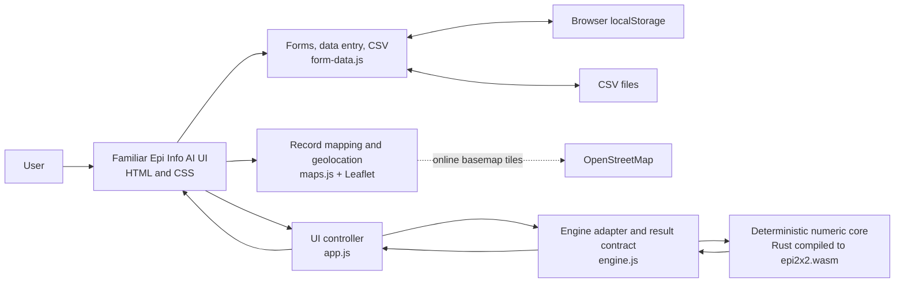

# Epi Info AI architecture

## Purpose

Epi Info AI is a browser-first application that preserves the familiar Epi Info
face and workflow while replacing the desktop implementation with modern web
components. Deterministic epidemiologic calculations belong in a WebAssembly
(WASM) engine. JavaScript connects that engine to the browser UI. AI is a future,
optional orchestration layer and must not calculate epidemiologic results itself.

This document distinguishes the code that exists in the current 2 x 2 spike from
the intended product architecture.

## Current 2 x 2 slice



The browser loads `app.js` as an ES module. It imports `engine.js`, which loads
`epi2x2.wasm` before accepting a calculation. All computation is local; the demo
does not send table data to a server.

### Rust/WASM responsibilities today

Source: `engine-rust/src/lib.rs`

| Calculation | Exported WASM function | Status |
|---|---|---|
| Risk among exposed | `risk_exposed` | Rust/WASM |
| Risk among unexposed | `risk_unexposed` | Rust/WASM |
| Risk ratio | `risk_ratio` | Rust/WASM |
| Odds ratio | `odds_ratio` | Rust/WASM |
| Risk difference | `risk_difference` | Rust/WASM |
| Pearson chi-square statistic | `pearson_chi_square` | Rust/WASM |
| Mantel-Haenszel chi-square statistic | `mantel_haenszel_chi_square` | Rust/WASM |
| Yates-corrected chi-square statistic | `yates_chi_square` | Rust/WASM |

The compiled browser artifact is `demo/epi2x2.wasm`. It is deliberately small
and has no runtime dependencies or operating-system access.

### JavaScript responsibilities today

| Responsibility | File | Status |
|---|---|---|
| Load and instantiate the WASM module | `demo/engine.js` | JavaScript |
| Validate cell counts and confidence level | `demo/engine.js` | JavaScript |
| Confidence intervals for RR, OR, and risk difference | `demo/engine.js` | JavaScript |
| Convert chi-square statistics to p-values | `demo/engine.js` | JavaScript |
| Fisher exact test | `demo/engine.js` | JavaScript |
| Expected cell counts and diagnostic warnings | `demo/engine.js` | JavaScript |
| Assemble the versioned `epi.table2x2` result object | `demo/engine.js` | JavaScript |
| Read inputs, handle events, and render results | `demo/app.js` | JavaScript |
| Format numbers, confidence intervals, and interpretation | `demo/app.js` | JavaScript |
| Copy the result JSON to the clipboard | `demo/app.js` | JavaScript |
| Form schema designer and field validation | `demo/form-data.js` | JavaScript |
| Project Explorer, field palette, drag/drop canvas, field positioning, and snap-to-grid preference | `demo/form-data.js` | JavaScript |
| Project data-store dialog and current project name | `demo/form-data.js` | JavaScript |
| Schema-driven record entry and line-list rendering | `demo/form-data.js` | JavaScript |
| Form schema and record persistence in `localStorage` | `demo/form-data.js` | JavaScript |
| CSV parsing, import mapping, quoting, and export download | `demo/form-data.js` | JavaScript |
| Form generation and field-type inference from CSV | `demo/form-data.js` | JavaScript |
| Coordinate-field selection and record-to-point filtering | `demo/maps.js` | JavaScript |
| Interactive map, layers, popups, and viewport control | `demo/maps.js` + Leaflet | JavaScript |
| One-shot browser geolocation and accuracy display | `demo/maps.js` | JavaScript |

HTML in `demo/index.html` provides the semantic application structure, including
a main menu that follows the module hierarchy and visual landmarks in the Epi
Info 7 manual. CSS in `demo/styles.css` supplies the familiar blue launch screen
and the responsive module workspaces. Neither contains statistical logic.

## Code layout

```text
wasm/
|-- architecture.md                 This document
|-- project.md                      Product and system direction
|-- feasibility-analysis.md         Port feasibility findings
|-- docs/
|   |-- design/                     UI compatibility decisions
|   `-- reference/                  Epi Info user documentation
|-- engine-rust/
|   |-- Cargo.toml                  Rust WASM crate definition
|   |-- README.md                   Local build instructions
|   `-- src/lib.rs                  Rust-implemented 2 x 2 primitives
`-- demo/
    |-- index.html                   Familiar browser UI structure
    |-- styles.css                   Visual design and responsive layout
    |-- app.js                       Browser interaction and rendering
    |-- form-data.js                 Forms, entry, local storage, and CSV
    |-- maps.js                      Record mapping and browser geolocation
    |-- engine.js                    JS/WASM boundary and result contract
    |-- epi2x2.wasm                 Compiled Rust artifact
    |-- vendor/leaflet/              Pinned interactive-map dependency
    `-- tests/fixtures/              Future parity-test inputs and results
```

## Boundary rules

1. The UI calls a versioned operation such as `epi.table2x2`; it does not depend
   directly on Rust implementation details.
2. Deterministic epidemiologic algorithms migrate to Rust/WASM after their
   expected behavior is captured in parity fixtures.
3. JavaScript owns browser concerns: DOM events, presentation, accessibility,
   module loading, storage adapters, and communication with optional services.
4. The result contract records the operation, engine identity, inputs, outputs,
   tests, and diagnostics so calculations can be audited.
5. AI may select tools and explain their results, but it may not replace the
   deterministic engine or silently alter its output.

## Migration plan

The current split is an incremental spike, not the final statistical boundary.
After validation fixtures are agreed, migrate in this order:

1. Confidence intervals and chi-square p-values.
2. Fisher exact and other exact methods.
3. Stratified 2 x 2 and Mantel-Haenszel estimates.
4. Frequencies, means, rates, and sample-size calculations.
5. Regression, survival, and other advanced analysis modules.

The JavaScript adapter should become thinner as algorithms move into Rust, while
the operation and result contracts remain stable for the UI and future AI tools.

## Not implemented yet

The current slice includes a project/form tree, drag-and-drop form designer,
and line-list proof of concept, but not the full Epi Info project or check-code
model. The data-store dialog currently creates browser-local demo state; it does
not create SQL Server or SQLite databases. The Maps slice keeps the manual's two
launch contexts separate: Main Menu -> Create Maps opens a standalone map with a
project/form data-source selector, while Enter Data -> Maps links the map to the
current form and allows a mapped record to be reopened in Enter Data. Both paths
support Add Data Layer -> Case Cluster and browser geolocation. The slice does not
yet provide external files/databases, satellite imagery, choropleths, spatial
analysis, geocoding, or offline basemap packages. The slice also does
not yet include project files, SQLite/OPFS persistence, dashboards, service-worker
offline installation, AI tool orchestration, or remote services. Those are
target-architecture components and should not be inferred from this demo.
