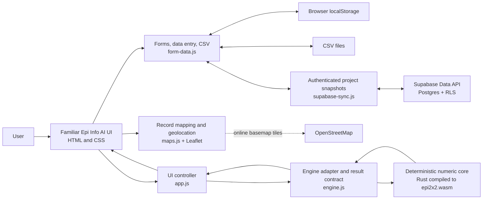

# Epi Info AI architecture

## Purpose

Epi Info AI is a browser-first application that preserves the familiar Epi Info
face and workflow while replacing the desktop implementation with modern web
components. Deterministic epidemiologic calculations belong in a WebAssembly
(WASM) engine. TypeScript is the default language for application features, while
a deliberately small JavaScript layer loads the application and connects the WASM
artifact to the browser. AI is a future, optional orchestration layer and must not
calculate epidemiologic results itself.

This document distinguishes the code that exists in the current 2 x 2 spike from
the intended product architecture.

## Language standard

| Layer | Standard language | Responsibilities |
|---|---|---|
| Epi kernel | Rust compiled to WASM | Deterministic epidemiologic calculations, numerical algorithms, and parity-tested result primitives |
| Product application | TypeScript | UI components, forms, validation, data entry, project state, CSV handling, maps, persistence adapters, synchronization, and tests |
| Runtime glue | JavaScript | Minimal bootstrapping and WASM/module loading where plain JavaScript materially simplifies browser startup |
| Presentation | HTML and CSS | Semantic application shell, familiar Epi Info layout, responsive styling, and accessibility structure |
| Third-party browser libraries | Pinned vendor JavaScript | Leaflet, h3-js, and other reviewed dependencies that are not maintained as project source |

New product feature modules must be written in TypeScript. Handwritten JavaScript
must remain small, dependency-free where practical, and contain no epidemiologic
business logic. TypeScript is compiled to JavaScript for GitLab Pages; browsers do
not execute TypeScript directly.

Shared operation and result contracts must be versioned. TypeScript types describe
the browser-facing contract, while Rust serialization and parity fixtures enforce
the same contract at the WASM boundary.

## Mobile-first, familiarity-preserving UI

New and migrated components use mobile-first CSS: the base layout supports a
small touch screen, and wider layouts are added with `min-width` media queries.
This migration happens module by module so the working desktop demo remains
usable throughout the transition.

Mobile-first does not mean replacing Epi Info with an unrelated generic mobile
design. The following familiarity contract applies at every viewport size:

- Preserve the Epi Info AI blue shell, terminology, module names, status feedback,
  and recognizable Create Forms, Enter Data, Classic, Dashboard, Maps, and StatCalc
  workflows.
- Preserve the Project Explorer, Form Designer canvas, field palette, line list,
  and map-layer concepts, even when they become drawers, tabs, or focused views on
  a narrow screen.
- Keep the same task order and labels across phone, tablet, and desktop so existing
  users do not have to learn different products.
- Reflow rather than shrink: stack panels, expose one primary task at a time, and
  allow intentional horizontal scrolling for genuinely tabular data.
- Use touch targets of at least 44 by 44 CSS pixels, visible keyboard focus,
  semantic controls, and screen-reader status announcements.
- Keep desktop density where space permits; wide screens should continue to resemble
  the legacy multi-pane application rather than an enlarged phone interface.

The migration order is Enter Data, project selection/storage, the main menu, Forms,
Maps, and then analysis workspaces. Each migrated module must be checked at phone,
tablet, and desktop widths before its old desktop-first rules are removed.

## Plugin architecture

Epi Info AI will support versioned browser plugins for bounded extension points,
without allowing arbitrary extensions to become part of the trusted core. Suitable
contributions include import/export adapters, validation rules, analysis tools,
dashboard gadgets, map layers, form field types, safe Check Code functions, and
optional AI tools that call deterministic operations.

Each plugin package declares a manifest containing its stable identifier, version,
host API version, entry point, integrity information, contributions, and requested
capabilities. The host grants only approved capabilities such as reading a selected
project, proposing record changes, contributing a panel, or invoking a named kernel
operation.

Plugin isolation rules are mandatory:

- Plugins do not receive Supabase tokens, service credentials, unrestricted storage,
  or direct access to the host DOM.
- Computation runs in a Worker or WASM sandbox. Rich plugin UI, when needed, runs in
  an isolated frame; ordinary UI contributions are declarative and rendered by the
  host so they inherit accessibility and mobile behavior.
- Network access is denied by default and must be separately declared, approved,
  and restricted to allowlisted origins.
- Record and project access is explicit, least-privilege, and mediated through a
  versioned message/RPC API.
- Production builds do not import executable plugins from arbitrary remote URLs.
  Distribution uses integrity-checked packages from a CDC-curated or organization-
  approved catalog, with revocation support.
- Plugin-generated calculations and changes record plugin ID, version, package hash,
  inputs, outputs, and user approval in provenance/audit data.

Core outbreak workflows and required statistical methods remain built in. Disabling
all plugins must leave forms, entry, core analysis, maps, import/export recovery, and
project access operational. Plugin compatibility follows explicit host API versions;
an incompatible plugin is disabled with an actionable explanation rather than run
with uncertain behavior.

## Current 2 x 2 slice



The browser loads `app.js` as an ES module. It imports `engine.js`, which loads
`epi2x2.wasm` before accepting a calculation. All computation is local; the demo
does not send table data to a server.

### Rust/WASM responsibilities today

Source: `engine-rust/src/lib.rs`

| Calculation | Exported WASM function | Status |
|---|---|---|
| Risk among exposed | `risk_exposed` | Rust/WASM |
| Risk among unexposed | `risk_unexposed` | Rust/WASM |
| Risk ratio | `risk_ratio` | Rust/WASM |
| Odds ratio | `odds_ratio` | Rust/WASM |
| Risk difference | `risk_difference` | Rust/WASM |
| Pearson chi-square statistic | `pearson_chi_square` | Rust/WASM |
| Mantel-Haenszel chi-square statistic | `mantel_haenszel_chi_square` | Rust/WASM |
| Yates-corrected chi-square statistic | `yates_chi_square` | Rust/WASM |

The compiled browser artifact is `demo/epi2x2.wasm`. It is deliberately small
and has no runtime dependencies or operating-system access.

### JavaScript responsibilities today (migration source)

| Responsibility | File | Status |
|---|---|---|
| Load and instantiate the WASM module | `demo/engine.js` | JavaScript |
| Validate cell counts and confidence level | `demo/engine.js` | JavaScript |
| Confidence intervals for RR, OR, and risk difference | `demo/engine.js` | JavaScript |
| Convert chi-square statistics to p-values | `demo/engine.js` | JavaScript |
| Fisher exact test | `demo/engine.js` | JavaScript |
| Expected cell counts and diagnostic warnings | `demo/engine.js` | JavaScript |
| Assemble the versioned `epi.table2x2` result object | `demo/engine.js` | JavaScript |
| Read inputs, handle events, and render results | `demo/app.js` | JavaScript |
| Format numbers, confidence intervals, and interpretation | `demo/app.js` | JavaScript |
| Copy the result JSON to the clipboard | `demo/app.js` | JavaScript |
| Form schema designer and field validation | `demo/form-data.js` | JavaScript |
| Project Explorer, field palette, drag/drop canvas, field positioning, and snap-to-grid preference | `demo/form-data.js` | JavaScript |
| Project data-store dialog, Supabase Data API connection test, and current project name | `demo/form-data.js` | JavaScript |
| Schema-driven record entry and line-list rendering | `demo/form-data.js` | JavaScript |
| Form schema and record persistence in `localStorage` | `demo/form-data.js` | JavaScript |
| CSV parsing, import mapping, quoting, and export download | `demo/form-data.js` | JavaScript |
| Form generation and field-type inference from CSV | `demo/form-data.js` | JavaScript |
| Supabase email/GitHub authentication, project snapshot upload/download, and revision conflict checks | `demo/supabase-sync.js` | JavaScript |
| Coordinate-field selection and record-to-point filtering | `demo/maps.js` | JavaScript |
| Interactive map, explicit raster/polygon/line/point pane hierarchy, popups, and viewport control | `demo/maps.js` + Leaflet | JavaScript |
| Browser-local GeoJSON validation, upload, rendering, and layer controls | `demo/maps.js` + Leaflet | JavaScript |
| Cumulative case-cluster time lapse from date/time fields | `demo/maps.js` + Leaflet | JavaScript |
| Configurable H3 indexing, record aggregation, and hexagon layers | `demo/maps.js` + h3-js + Leaflet | JavaScript |
| One-shot browser geolocation and accuracy display | `demo/maps.js` | JavaScript |

HTML in `demo/index.html` provides the semantic application structure, including
a main menu that follows the module hierarchy and visual landmarks in the Epi
Info 7 manual. CSS in `demo/styles.css` supplies the familiar blue launch screen
and the responsive module workspaces. Neither contains statistical logic.

## Code layout

```text
wasm/
|-- architecture.md                 This document
|-- migration-plan.md               Phased execution and acceptance gates
|-- project.md                      Product and system direction
|-- feasibility-analysis.md         Port feasibility findings
|-- docs/
|   |-- design/                     UI compatibility decisions
|   `-- reference/                  Epi Info user documentation
|-- engine-rust/
|   |-- Cargo.toml                  Rust WASM crate definition
|   |-- README.md                   Local build instructions
|   `-- src/lib.rs                  Rust-implemented 2 x 2 primitives
`-- demo/
    |-- index.html                   Familiar browser UI structure
    |-- styles.css                   Visual design and responsive layout
    |-- app.js                       Browser interaction and rendering
    |-- form-data.js                 Forms, entry, local storage, and CSV
    |-- supabase-sync.js             Authenticated Supabase snapshot synchronization
    |-- maps.js                      Record mapping and browser geolocation
    |-- engine.js                    JS/WASM boundary and result contract
    |-- epi2x2.wasm                 Compiled Rust artifact
    |-- vendor/                      Pinned Leaflet and h3-js map dependencies
    `-- tests/fixtures/              Future parity-test inputs and results
```

## Boundary rules

1. The UI calls a versioned operation such as `epi.table2x2`; it does not depend
   directly on Rust implementation details.
2. Deterministic epidemiologic algorithms migrate to Rust/WASM after their
   expected behavior is captured in parity fixtures.
3. TypeScript owns browser feature logic: DOM events, presentation behavior,
   accessibility, storage adapters, and communication with optional services.
   JavaScript is limited to bootstrapping, WASM loading, and pinned vendor code.
4. The result contract records the operation, engine identity, inputs, outputs,
   tests, and diagnostics so calculations can be audited.
5. AI may select tools and explain their results, but it may not replace the
   deterministic engine or silently alter its output.
6. Plugins use only the versioned capability API. They do not import application
   internals, bypass validation/RLS, or become required for core workflows.

## Migration plan

The detailed, execution-ready plan is maintained in
[`migration-plan.md`](migration-plan.md). It coordinates the TypeScript, Rust/WASM,
mobile-first UI, validation, storage, synchronization, CI, and testing work.

The current split is an incremental spike, not the final statistical boundary.
After validation fixtures are agreed, migrate statistical work in this order:

1. Confidence intervals and chi-square p-values.
2. Fisher exact and other exact methods.
3. Stratified 2 x 2 and Mantel-Haenszel estimates.
4. Frequencies, means, rates, and sample-size calculations.
5. Regression, survival, and other advanced analysis modules.

The WASM adapter should become thinner as algorithms move into Rust, while the
operation and result contracts remain stable for the TypeScript UI and future AI
tools.

### TypeScript migration

1. Add a pinned TypeScript build and type-check step to the GitLab Pages pipeline.
2. Migrate `app.js`, `form-data.js`, `maps.js`, and `supabase-sync.js` to typed
   modules without changing their user-visible behavior.
3. Define shared types for projects, forms, fields, records, synchronization
   metadata, map layers, and versioned epidemiologic results.
4. Reduce `engine.js` and `shell.js` to the smallest practical JavaScript loading
   boundary; move validation, formatting, and result assembly into TypeScript or
   Rust according to ownership.
5. Disallow new feature logic in JavaScript after the build is established.

## TODO

- [ ] Add multi-user, record-level project synchronization.
  - Introduce project membership and roles protected by Row Level Security.
  - Store forms and records as individually versioned rows instead of one
    whole-project JSON snapshot.
  - Merge changes automatically when users edit different records.
  - Detect and present a resolution workflow when users edit the same record.
  - Record who created and changed each record, including timestamps and
    deletion markers, for an auditable history.

Until this item is complete, hosted projects are single-user working copies and
the application does not merge data entered by different people.

## Not implemented yet

The current slice includes a project/form tree, drag-and-drop form designer,
and line-list proof of concept, but not the full Epi Info project or check-code
model. The data-store dialog currently creates browser-local demo state; it does
not create SQL Server or SQLite databases. Project Storage can connect the current
project to Supabase, authenticate by email or an enabled GitHub provider, and upload/download an RLS-protected JSON
snapshot with revision conflict checks. The current sync model is an intentionally simple
whole-project snapshot rather than normalized form and record tables. The Maps slice keeps the manual's two
launch contexts separate: Main Menu -> Create Maps opens a standalone map with a
project/form data-source selector, while Enter Data -> Maps links the map to the
current form and allows a mapped record to be reopened in Enter Data. Both paths
support Add Data Layer -> Case Cluster, browser-local GeoJSON reference layers with zoom-dependent polygon labels, configurable H3 aggregation layers, cumulative date/time animation, compact layer controls, fullscreen mapping, and browser geolocation. The slice does not
yet provide external databases, shapefiles, satellite imagery, choropleths, spatial
analysis, geocoding, or offline basemap packages. The slice also does
not yet include project files, SQLite/OPFS persistence, dashboards, service-worker
offline installation, a plugin runtime/catalog, AI tool orchestration, or remote services. Those are
target-architecture components and should not be inferred from this demo.
