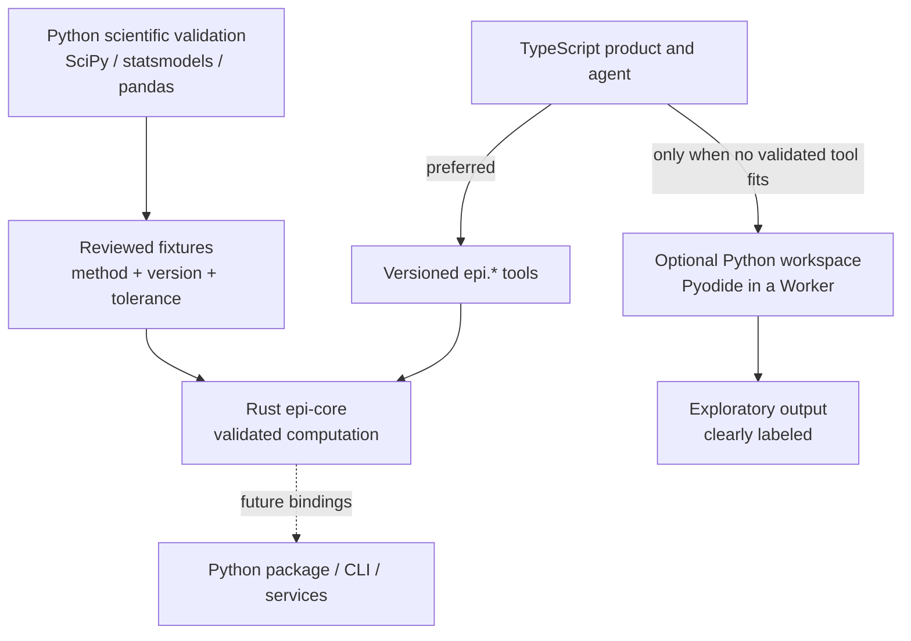
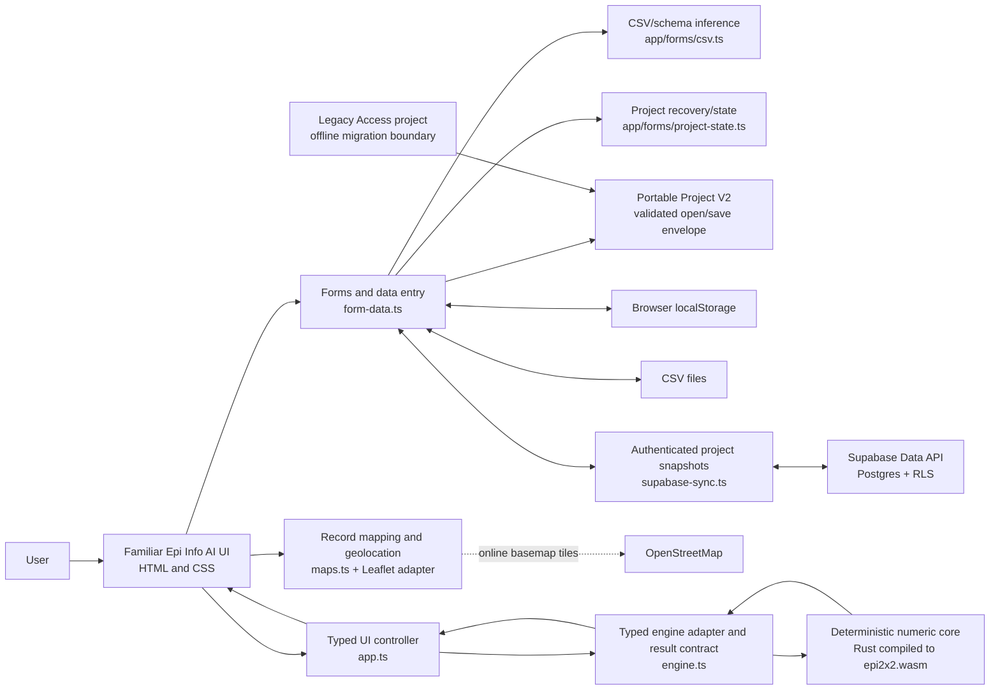

# Epi Info AI architecture

## Purpose

Epi Info AI is a browser-first application that preserves the familiar Epi Info
face and workflow while replacing the desktop implementation with modern web
components. The canonical Epi Info programming-language engine and deterministic
epidemiologic calculations belong in Rust compiled to WebAssembly (WASM).
TypeScript owns browser-facing product features and permissioned host adapters,
while generated bindings and a deliberately small JavaScript bootstrap connect
the WASM artifacts to the browser. AI is an optional orchestration layer and must not
calculate epidemiologic results itself. Python supports scientific validation,
test-data generation, agent research, and optional exploratory analysis; it is not
the primary browser application language or a second trusted statistics engine.

This document distinguishes the code that exists in the current 2 x 2 candidate kernel from
the intended product architecture.

## Language standard

| Layer | Standard language | Responsibilities |
|---|---|---|
| Epi language engine (`epi-lang`) | Rust compiled to WASM | Lexer, parser, typed AST, semantic analysis, capability-labelled execution planning, program sequencing, interpreter state, diagnostics, and auditable execution events |
| Epi kernel | Rust compiled to WASM | Deterministic epidemiologic calculations, numerical algorithms, and parity-tested result primitives |
| Product application and host | TypeScript | UI components, editor integration, forms, validation, data entry, project state, browser permissions, tabular import/export, maps, persistence adapters, synchronization, and tests; fulfills typed host requests but does not redefine command semantics |
| Scientific development tooling | Python | Independent statistical comparison, synthetic fixture generation, agent evaluation, and research notebooks outside the production browser path |
| Optional exploratory workspace | Python on Pyodide | User-visible, sandboxed advanced analysis loaded on demand in a Web Worker; never presented as a validated Epi Info result |
| Optional service integration | Python or Rust | Future report, interoperability, aggregation, or AI-gateway services selected per service requirements |
| Runtime glue | JavaScript | Minimal bootstrapping and WASM/module loading where plain JavaScript materially simplifies browser startup |
| Presentation | HTML and CSS | Semantic application shell, familiar Epi Info layout, responsive styling, and accessibility structure |
| Third-party browser libraries | Pinned vendor JavaScript | Leaflet, h3-js, and other reviewed dependencies that are not maintained as project source |
| Optional AI | TypeScript Worker + local IBM Granite, or an approved same-origin gateway to managed foundation models | Natural-language proposals over minimized context; typed host actions only, never statistical authority |

New browser product feature modules must be written in TypeScript. New Epi Info
language syntax or execution semantics must be implemented in `epi-lang`, and new
validated epidemiologic algorithms must be implemented in `epi-core`. Handwritten JavaScript
must remain small, dependency-free where practical, and contain no epidemiologic
business logic. TypeScript is compiled to JavaScript for GitLab Pages; browsers do
not execute TypeScript directly.

Shared operation, host-capability, execution-event, and result contracts must be
versioned. Rust is authoritative for language semantics. TypeScript consumes
generated or mechanically checked bindings for the browser-facing contract, while
cross-boundary fixtures prevent either side from inventing a second interpretation.

The runtime choice is therefore based on the role, not on a claim that only one
language can run in a browser:

| Need | Selected runtime | Reason |
|---|---|---|
| Epi Info program interpretation | Rust/WASM `epi-lang` | One parser and interpreter shared by browser, future native CLI, and future Python bindings |
| Familiar Epi Info product workflows | TypeScript | Direct browser platform access, accessible components, and permissioned fulfillment of typed interpreter requests |
| Official, versioned Epi calculations | Rust/WASM | A purpose-built, strongly typed kernel with explicit errors and one implementation shared by browser and future native bindings |
| Transparent cross-implementation validation | CPython on Pyodide | Runs scientific Python in the browser and can call the deployed Rust/WASM artifact from the same notebook |
| Custom or experimental analysis | Optional CPython on Pyodide | Broad scientific ecosystem and rapid iteration, with an explicitly lower exploratory trust level |

CPython in the browser is technically viable through
[Pyodide](https://pyodide.org/en/stable/), a WebAssembly distribution of Python.
It was not rejected as incapable. It remains outside the ordinary product path
because embedding a general-purpose Python runtime and scientific packages has a
different download, startup, memory, package-compatibility, and governance profile
from loading a focused Epi kernel. These budgets must be measured on supported
low-resource devices before an Advanced Analysis workspace is promoted.

Every algorithm and third-party numerical dependency is governed by the
[algorithm validation standard](docs/validation/algorithm-validation-standard.md).
The current [Rust epidemiology landscape assessment](docs/research/rust-epidemiology-landscape.md)
supports an Epi Info-owned `epi-core` facade: candidate crates may implement a
method behind that facade only after independent evidence, native/WASM parity,
source/dependency review, and statistical approval. Upstream claims of SciPy, R,
or statsmodels parity seed our review but do not confer validated status.

## Python role and trust boundary

Python is a supporting scientific and interoperability language. The production
application remains TypeScript, and validated epidemiologic operations remain in
the canonical Rust kernel. This prevents the browser, notebook, command-line, and
future service paths from developing different implementations of the same Epi
Info method.



### Development and validation

Python is well suited to generating synthetic edge cases and comparing Rust results
with independent scientific libraries. Candidate uses include sparse and zero-cell
tables, missing values, extreme sample sizes, weights, many strata, regression
convergence cases, agent tool-selection evaluations, and performance datasets.

Python output is not accepted as ground truth merely because a library produced it.
Every promoted fixture records the reference package and version, statistical
method and options, expected result, tolerance, and reviewer decision. Rust native
tests and browser WASM tests consume the same reviewed, data-only fixtures. Python
is development tooling and is not required to build, start, or use the core browser
application.

### Browser validation notebook and optional Advanced Analysis

The V0.4 JupyterLite validation lab uses one Pyodide Python kernel in a Web Worker.
The notebook derives the potato-salad table from the frozen foodborne corpus,
calls the deployed Rust/WASM module through Pyodide's JavaScript bridge, and
compares its point estimates, intervals, chi-square p-values, exact tails,
conditional odds ratio, and exact odds-ratio limits with SciPy.
It is a validation demonstration, not a second product statistics engine. The
[JupyterLite kernel documentation](https://jupyterlite.readthedocs.io/en/stable/howto/configure/kernels.html)
confirms that its Pyodide kernel executes in a worker, which keeps notebook
computation off the application UI thread.

A later, separately gated Advanced Analysis feature may use the same class of
runtime for user-authored local analysis. It must:

- be optional and lazy-loaded so ordinary Epi Info workflows do not pay its
  download, startup, or memory cost;
- run in a dedicated Web Worker with time, memory, output-size, and cancellation
  controls;
- receive only an explicit, mediated dataset view and no authentication tokens,
  unrestricted project storage, host DOM access, or ambient network capability;
- label code, charts, tables, and narratives as exploratory rather than validated
  Epi Info results;
- require an explicit reviewed action before generated code can change project
  records; and
- preserve code, inputs, package/runtime versions, outputs, warnings, and execution
  status as provenance when a user saves an analysis.

The agent must prefer versioned `epi.*` operations backed by Rust. It may propose
the Python sandbox only when no suitable validated operation exists, and it must
make that change in trust level visible to the user. Pyodide is not part of the
initial offline application shell because low-resource device budgets must be
measured first.

The current validation lab fetches Pyodide and scientific packages on demand from
the configured distribution/CDN. It therefore requires a network connection on
first use and must not be described as offline-capable. A self-hosted, pinned
Pyodide distribution and an offline cache/update policy are release gates for an
offline validation lab or Advanced Analysis workspace.

### Python bindings and optional services

Future Python bindings should call the same native Rust `epi-core` library used to
produce browser WASM rather than translating algorithms into Python. This can make
validated Epi Info operations available to Jupyter, research pipelines, command-line
tools, and optional services while retaining one canonical engine and result
contract.

Python may also be selected for future APIs, report generation, FHIR or DHIS2
adapters, surveillance aggregation, and model evaluation. Those services remain
optional boundaries: privileged credentials never enter browser or Pyodide code,
and a Python service does not silently replace local validated computation.

## Programming views and source authority

The future programming workspace has three synchronized views: **Flow** (Visual
Epi Info), **Program** (the traditional source editor), and **Output**. Both Flow
and Program are clients of the same versioned Rust `epi-lang` intermediate
representation. `epi-lang` invokes validated calculations in Rust `epi-core` and
emits typed requests for browser capabilities it cannot and must not own.

The complete effective code is always visible in Program. Visual Epi Info cannot
hide, replace, or become the sole representation of a program. Visual changes are
previewable as source changes; source changes are reparsed before the flow updates.
Unsupported or non-round-trippable constructs remain visible and editable as
preserved source and mark the flow as partial or source-only. Neither view can
translate a program into arbitrary JavaScript or grant it ambient DOM, network,
credential, filesystem, database, or process access.

### Canonical Rust language engine

`epi-lang` is the sole long-term authority for:

- lexical and grammatical interpretation of `.pgm` and `.pgm7` source;
- typed AST nodes, source spans, canonical printing, and recoverable diagnostics;
- variable scopes, expressions, missing-value behavior, control flow, selection,
  sorting, command sequencing, and cancellation checkpoints;
- semantic resolution against a versioned dataset/schema description;
- capability-labelled execution plans and fail-closed unsupported syntax; and
- deterministic execution events used by Output and command history.

Pure language operations and epidemiologic calculations remain inside Rust.
Browser effects cross a narrow request/response protocol. For example, `WRITE`
semantics are resolved by `epi-lang`, which may emit an `export-table` request
containing the validated format, fields, and rows. TypeScript asks for any needed
user permission and performs the browser download; it does not reinterpret the
`WRITE` statement. The same pattern applies to project data, dialogs, maps,
printing, and other host-owned facilities.

The host protocol is explicit and capability based. Every request carries a
schema version, program/source span, command identity, dataset revision, requested
capability, and bounded payload. The TypeScript host may fulfill, deny, cancel, or
return a typed error. It cannot grant ambient DOM, storage, network, credential,
filesystem, database, or process access to the interpreter. Execution resumes
only with the typed response, and both request and outcome become audit events.

`epi-lang` and `epi-core` are separate Rust crates even when shipped in one WASM
artifact. This keeps language compatibility independent from statistical method
versions while allowing statistical commands to call the canonical kernel without
duplicating formulas across a TypeScript interpreter boundary.

The language crate preserves explicit dialect boundaries. Classic Analysis PGM is
the first migration target under `epi-lang::classic`; Form Designer/Enter Data
Check Code later uses `epi-lang::check_code` and its own event and field-mutation
rules. They may share tokens, expressions, source infrastructure, diagnostics, and
host capabilities, but one dialect must not silently inherit semantics from the
other merely because command names overlap.

### Transitional TypeScript implementation

The first maintained language boundary is `app/programming/classic-ast.ts`. It
defines AST version `1.0.0`, source spans, typed expressions, and statement nodes
for `READ`, `RELATE`, `WRITE`, `MERGE`, `DELETE TABLES`, `DELETE RECORDS`, `UNDELETE RECORDS`, `LIST`, `FREQ`, `MEANS`, `TABLES`, `SUMMARIZE`, `RECODE`, `DEFINE`, `DEFINE GROUPVAR`, `UNDEFINE`, `ASSIGN`, `DISPLAY`, `IF`, `SELECT`, and `SORT`.
CodeMirror may currently use this broader subset for diagnostics, but parsing does
not grant execution authority. `classic-program.ts` remains the narrower reviewed
lowerer/executor for the existing prototype. These TypeScript modules are an
executable specification and migration scaffold, not the permanent interpreter.
They must not grow into a second complete implementation while `epi-lang` is built.

Commands migrate in vertical slices. Each slice must preserve the existing parser,
browser, `.pgm`, expected-output, and legacy differential fixtures; reproduce its
syntax, semantic plan, execution events, state effects, diagnostics, and output
through Rust/WASM; switch the editor and runner to the Rust result; and then remove
the replaced TypeScript semantic/execution path. Temporary differential execution
is test-only. Production must never choose between two interpreters.

```text
source / dialog / visual flow / reviewed AI proposal
                         |
                         v
                 Rust/WASM epi-lang
           lexer -> typed AST -> semantics
                         |
            capability-labelled execution
                         |
             +-----------+-----------+
             |                       |
             v                       v
      Rust epi-core             typed host request
      calculations                    |
                                      v
                          TypeScript browser host
                    UI / storage / files / maps / network
                                      |
                              typed response + audit
```

## Mobile-first, familiarity-preserving UI

New and migrated components use mobile-first CSS: the base layout supports a
small touch screen, and wider layouts are added with `min-width` media queries.
This migration happens module by module so the working desktop demo remains
usable throughout the transition.

Mobile-first does not mean replacing Epi Info with an unrelated generic mobile
design. The following familiarity contract applies at every viewport size:

- Preserve the Epi Info AI blue shell, terminology, module names, status feedback,
  and recognizable Create Forms, Enter Data, Classic, Dashboard, Maps, and StatCalc
  workflows.
- Preserve the Project Explorer, Form Designer canvas, field palette, line list,
  and map-layer concepts, even when they become drawers, tabs, or focused views on
  a narrow screen.
- Keep the same task order and labels across phone, tablet, and desktop so existing
  users do not have to learn different products.
- Reflow rather than shrink: stack panels, expose one primary task at a time, and
  allow intentional horizontal scrolling for genuinely tabular data.
- Use touch targets of at least 44 by 44 CSS pixels, visible keyboard focus,
  semantic controls, and screen-reader status announcements.
- Keep desktop density where space permits; wide screens should continue to resemble
  the legacy multi-pane application rather than an enlarged phone interface.

The migration order is Enter Data, project selection/storage, the main menu, Forms,
Maps, and then analysis workspaces. Each migrated module must be checked at phone,
tablet, and desktop widths before its old desktop-first rules are removed.

Phase 3A applies this model to the persistent titlebar, application menu, main
launcher, and module navigation. `demo/styles.css` defines shared palette, surface,
status, spacing, radius, focus, shell-height, and control-size tokens. Its base
shell rules target phones; `min-width: 641px` restores tablet composition and
`min-width: 961px` restores the familiar desktop launcher and left module tree.
Module-specific workspaces retain transitional responsive rules until their named
migration phase, preventing a shell refactor from changing Forms, Data, or Maps
behavior implicitly.

The shell compatibility floor and its C#/XAML/manual evidence are recorded in
`docs/design/shell-compatibility-inventory.md`. Responsive reflow is classified as
an adaptation of the same old tree, not a new branch or a retirement.

Phase 3B applies the same rule to Enter Data. The schema remains the single source
of field prompt and order. A narrow-screen view state in `form-data.ts` switches
between the existing entry and line-list panels without copying or transforming
records. The base CSS shows entry first; tablet rules expose both panels in order,
and desktop rules restore the two-column workspace. Save/import status remains in
the panel that initiated it, while project storage state remains in the module
heading. The legacy floor and deferred lifecycle/validation behavior are tracked
in `docs/design/enter-data-compatibility-inventory.md`.

Phase 3C applies a shared mobile-first dialog shell to project creation and hosted
storage. Dialog forms are bounded by the dynamic viewport; titles and actions stay
outside the scrollable body. Supabase presentation separates three feedback
channels—connection, account, and synchronization—so asynchronous results remain
next to their initiating controls. A single summary state exposes offline, local,
pending, connected, synchronized, or failed without treating saved credentials as
proof of synchronization. Only successful upload or validated download emits the
synchronized state.

Browser-local storage and Supabase are explicit new branches under the familiar
project/storage tree, not replacements for legacy project, Access, or SQL Server
compatibility. Their disposition and safe adapter boundaries are recorded in
`docs/design/storage-compatibility-inventory.md`.

## Plugin architecture

Epi Info AI will support versioned browser plugins for bounded extension points,
without allowing arbitrary extensions to become part of the trusted core. Suitable
contributions include import/export adapters, validation rules, analysis tools,
dashboard gadgets, map layers, form field types, safe Check Code functions, and
optional AI tools that call deterministic operations.

Each plugin package declares a manifest containing its stable identifier, version,
host API version, entry point, integrity information, contributions, and requested
capabilities. The host grants only approved capabilities such as reading a selected
project, proposing record changes, contributing a panel, or invoking a named kernel
operation.

Plugin isolation rules are mandatory:

- Plugins do not receive Supabase tokens, service credentials, unrestricted storage,
  or direct access to the host DOM.
- Computation runs in a Worker or WASM sandbox. Rich plugin UI, when needed, runs in
  an isolated frame; ordinary UI contributions are declarative and rendered by the
  host so they inherit accessibility and mobile behavior.
- Network access is denied by default and must be separately declared, approved,
  and restricted to allowlisted origins.
- Record and project access is explicit, least-privilege, and mediated through a
  versioned message/RPC API.
- Production builds do not import executable plugins from arbitrary remote URLs.
  Distribution uses integrity-checked packages from a CDC-curated or organization-
  approved catalog, with revocation support.
- Plugin-generated calculations and changes record plugin ID, version, package hash,
  inputs, outputs, and user approval in provenance/audit data.

Core outbreak workflows and required statistical methods remain built in. Disabling
all plugins must leave forms, entry, core analysis, maps, import/export recovery, and
project access operational. Plugin compatibility follows explicit host API versions;
an incompatible plugin is disabled with an actionable explanation rather than run
with uncertain behavior.

## Current 2 x 2 slice



The production build compiles maintained modules from `demo/` into `dist/` with
external source maps; GitLab Pages publishes `dist/`. During the incremental
transition, esbuild accepts either a `.ts` or legacy `.js` source for each module,
so modules can move independently without a flag-day rewrite. Modules that consume
TypeScript runtime contracts are bundled at that boundary; raw TypeScript source is
not copied into the published artifact.

The browser loads `app.js` as an ES module. It imports `engine.js`, which loads
`epi2x2.wasm` before accepting a calculation. All computation is local; the demo
does not send table data to a server.

### Rust/WASM responsibilities today

Source: `engine-rust/src/lib.rs`

| Calculation | Exported WASM function | Status |
|---|---|---|
| Risk among exposed | `risk_exposed` | Rust/WASM |
| Risk among unexposed | `risk_unexposed` | Rust/WASM |
| Risk ratio | `risk_ratio` | Rust/WASM |
| Odds ratio | `odds_ratio` | Rust/WASM |
| Risk difference | `risk_difference` | Rust/WASM |
| Odds-ratio Wald interval | `odds_ratio_ci_lower`, `odds_ratio_ci_upper` | Rust/WASM candidate |
| Risk-ratio Katz interval | `risk_ratio_ci_lower`, `risk_ratio_ci_upper` | Rust/WASM candidate |
| Risk-difference unpooled Wald interval | `risk_difference_ci_lower`, `risk_difference_ci_upper` | Rust/WASM candidate |
| Pearson chi-square statistic | `pearson_chi_square` | Rust/WASM |
| Mantel-Haenszel chi-square statistic | `mantel_haenszel_chi_square` | Rust/WASM |
| Yates-corrected chi-square statistic | `yates_chi_square` | Rust/WASM |
| One-degree-of-freedom chi-square survival probability | `chi_square_p_value` | Rust/WASM candidate |
| Fisher lower, upper, one-tailed, and probability-ordered two-tailed p-values | `fisher_exact_*` | Rust/WASM candidate; Epi Info `1.000001` ordering tolerance retained |
| Mid-p lower, upper, and one-tailed p-values | `mid_p_exact_*` | Rust/WASM candidate; half the observed-table probability is removed from each inclusive tail |
| Conditional maximum-likelihood odds ratio | `conditional_odds_ratio` | Rust/WASM candidate; noncentral-hypergeometric conditional-mean root |
| Exact Fisher odds-ratio limits | `conditional_odds_ratio_fisher_lower`, `conditional_odds_ratio_fisher_upper` | Rust/WASM candidate; central-tail inversion |
| Exact mid-p odds-ratio limits | `conditional_odds_ratio_mid_p_lower`, `conditional_odds_ratio_mid_p_upper` | Rust/WASM candidate; half-observed tail inversion |
| Stratified MH adjusted OR and legacy confidence limits | `stratified_mh_odds_ratio*` | Rust/WASM V0.5 candidate |
| Stratified MH adjusted RR and legacy confidence limits | `stratified_mh_risk_ratio*` | Rust/WASM V0.5 candidate |
| Stratified MH corrected/uncorrected association tests | `stratified_mh_chi_square_*` | Rust/WASM V0.5 candidate |
| Stratified fixed-margin Breslow-Day and Tarone OR homogeneity | `stratified_breslow_day_*` | Rust/WASM V0.6 candidate |
| Legacy Epi Info-labelled Woolf OR homogeneity | `stratified_legacy_woolf_odds_ratio` | Rust/WASM V0.6 compatibility candidate |
| Legacy Epi Info-labelled Woolf RR homogeneity | `stratified_legacy_woolf_risk_ratio` | Rust/WASM V0.7 compatibility candidate |
| General chi-square survival probability | `chi_square_p_value_df` | Rust/WASM V0.6 candidate |
| Stratified conditional common OR and central Fisher limits | `stratified_conditional_odds_ratio*` | Rust/WASM V0.8 bounded candidate |
| Frequency proportion and legacy exact/Wilson category limits | `frequency_proportion`, `frequency_ci_*` | Rust/WASM V0.9 candidate |
| Single-variable descriptive statistics and legacy rank quartiles/mode | `means_*` | Rust/WASM V0.10 bounded candidate |
| Visual Dashboard rate from validated numerator/denominator aggregates and multiplier | `rate_calculate` | Rust/WASM V0.11 bounded candidate |
| Visual Dashboard Epi Curve binning and browser rendering | `app/dashboard/epi-curve.ts`, `demo/app.ts` | TypeScript V0.16 presentation/application slice; not statistical inference |
| Population Survey cluster size with legacy normal approximation and correction/rounding sequence | `population_survey_cluster_size` | Rust/WASM V0.12 bounded candidate |
| Cohort/Cross-Sectional effect conversions and Kelsey/Fleiss group sample sizes | `cohort_exposed_outcome`, `cohort_odds_from_*`, `cohort_sample_size` | Rust/WASM V0.13 bounded candidate |
| Unmatched Case-Control exposure conversions and Kelsey/Fleiss group sample sizes | `unmatched_case_control_*` | Rust/WASM V0.14 bounded candidate |
| Chi Square for Trend row buffer, reference odds ratios, Extended Mantel-Haenszel statistic, and p value | `trend_*` | Rust/WASM V0.15 bounded candidate |

The compiled browser artifact is `demo/epi2x2.wasm`. It is deliberately small
and has no runtime dependencies or operating-system access.

### TypeScript responsibilities today

| Responsibility | File | Status |
|---|---|---|
| Load, validate, and instantiate the WASM module | `demo/engine.ts` | TypeScript with a confined WASM runtime boundary |
| Validate cell counts and confidence level | `demo/engine.ts` | TypeScript pending validated Rust migration |
| Select confidence multiplier and call interval exports | `demo/engine.ts` | TypeScript adapter; interval arithmetic is Rust/WASM |
| Fisher and mid-p exact result assembly | `demo/engine.ts` | Thin TypeScript adapter over Rust/WASM exact-method exports |
| Expected counts and warnings | `demo/engine.ts` | TypeScript result diagnostics |
| Assemble the versioned `epi.table2x2` result object | `demo/engine.ts` + `app/contracts/engine.ts` | TypeScript |
| Assemble the versioned `epi.stratified2x2` request/result and load the synchronous WASM scratch buffer | `demo/engine.ts` + `app/contracts/engine.ts` | TypeScript adapter inside the analysis Worker; epidemiologic sums and formulas remain Rust |
| Isolate, cancel, and recover stratified computation | `demo/stratified-worker.ts` + `demo/stratified-worker-client.ts` | Lazy TypeScript Worker boundary with a readiness handshake and watchdog; cancellation terminates the Worker and its private WASM scratch state |
| Derive named 2 x 2 strata from current-form records, explicit value mappings, and missing-value rules | `demo/engine.ts` + `app/contracts/engine.ts` | TypeScript data adapter; emits an audited request for the Rust operation |
| Group typed current-form categories, sort them, apply missing rules, and assemble `epi.frequency` | `demo/engine.ts` + `app/contracts/engine.ts` | TypeScript adapter; proportions and confidence limits are Rust/WASM |
| Parse and apply the bounded `DEFINE TEXTINPUT -> numeric RECODE -> FREQ [STRATAVAR]` program plan | `app/programming/classic-program.ts` | Transitional TypeScript executable specification; source is never evaluated; migrate command slices to Rust `epi-lang` and delete replaced execution paths |
| Parse the initial Classic language surface into versioned typed statements/expressions with source spans | `app/programming/classic-ast.ts` | Transitional TypeScript AST/parser fixture source; Rust `epi-lang` is the target authority, and parsing alone does not authorize execution |
| Validate and load dataset-bound example-program catalogs | `app/programming/classic-examples.ts` + `demo/examples/*.programs.json` | The foodborne dataset owns three `DEFINE -> RECODE -> FREQ` examples and two TABLES examples; the app treats the JSON as validated external data and uses the same AST-to-plan boundary as user source |
| Edit and highlight bounded Epi Info source; show line/column and configurable indentation; offer schema-aware completion; run live syntax diagnostics | `app/programming/classic-editor.ts` | TypeScript + CodeMirror 6 presentation client; during migration it uses the TypeScript scaffold, then consumes Rust `epi-lang` diagnostics/completions through generated bindings; suggestions and diagnostics have no execution authority |
| Store the browser-local V0.1 command history contract | `app/programming/run-history.ts` | TypeScript; unified origins and immutable hosted provenance remain open |
| Select finite numeric observations, report exclusions, and assemble `epi.means` | `demo/engine.ts` + `app/contracts/engine.ts` | TypeScript adapter; descriptive formulas, sorting, quartiles, and mode are Rust/WASM |
| Read inputs, handle events, format, render, and copy results | `demo/app.ts` | TypeScript |
| Form schema designer, Project Explorer, palette, drag/drop, and snap preference | `demo/form-data.ts` | TypeScript |
| Project data-store dialog, Supabase connection test, record entry, and line list | `demo/form-data.ts` | TypeScript |
| Typed field rules, calculated-age materialization, signed decimal-degree coordinate precision, and saved-record validation | `app/contracts/validation.ts` + `app/forms/validation.ts` | TypeScript; deterministic product behavior, not epidemiologic kernel computation |
| Safe allowlisted Check Code statements and entry-time field actions | `app/contracts/check-code.ts` + `app/forms/entry-view.ts` | TypeScript; arbitrary imported code is never evaluated |
| Legacy `GEOCODE` Click command, provider response validation, explicit result selection, and coordinate-field mutation | `app/contracts/check-code.ts` + `app/forms/geocoding.ts` + `app/forms/entry-view.ts` | TypeScript; provider-neutral contract with a demonstration-only OpenStreetMap Nominatim adapter |
| Completeness, validation issues, duplicate candidates, Recycle Bin, and audit UI | `app/forms/data-quality.ts` + `demo/form-data.ts` | TypeScript; lifecycle data is part of the validated project snapshot |
| Delimited parsing, CSV export, and schema inference | `app/forms/csv.ts` | TypeScript |
| CSV, TSV, JSON-record, and Excel `.xlsx` input adapters | `app/forms/importers.ts` | TypeScript with a pinned, browser-only `read-excel-file` boundary |
| Project snapshot load/recovery boundary | `app/forms/project-state.ts` | TypeScript |
| Dataset-independent study-area capture, WGS 84 bounding polygon, size/zoom guidance, provider policy, Web Mercator tile/byte estimate, browser quota preflight, and offline-map plan | `app/forms/study-area-picker.ts` + `app/maps/offline-map-estimator.ts` + `app/contracts/core.ts` | TypeScript new branch over the confined Leaflet global; stores versioned planning metadata. Browser cache is opportunistic; an imported PMTiles archive can be stored in OPFS without a runtime server. The portable snapshot remains `stored-unverified` because it may move independently of the local archive; Maps performs runtime verification |
| PMTiles v3 validation, browser-local archive storage, bounded raster/vector rendering, portable backup, and recovery | `app/maps/pmtiles-import.ts` + `app/maps/pmtiles-reader.ts` + `app/maps/maplibre-pmtiles.ts` + `app/contracts/project-archive.ts` + `app/forms/study-area-picker.ts` + `demo/maps.ts` + `app/contracts/core.ts` | TypeScript new branch; explicit `File` grant, bounded header/metadata parser, coverage/license/SHA-256 checks, commit-on-Apply OPFS write, uncommitted cleanup, typed provenance, directory/Hilbert lookup, and gzip support. PNG/JPEG/WebP/AVIF use a Leaflet grid layer. MVT lazy-loads self-hosted MapLibre 6.6 with a local custom protocol and metadata-declared source layers beneath the existing Leaflet overlays. Build-time code splitting keeps MapLibre off the ordinary startup path. Runtime activation rechecks size, digest, and header and removes the online Street layer. Save Project As emits a bounded binary `.epia` envelope with the V2 manifest followed by raw deduplicated PMTiles payloads; Open Project validates every payload before restoring it to a new OPFS path. Missing/corrupt/unavailable OPFS states fail to blank and expose restore, exact-digest re-import, or detach actions without discarding the study-area plan. Field-offline acceptance remains a separate gate |
| Typed Form Designer File/Edit/View/Insert/Format/Tools/Help tree, command state, disposition, and renderer | `app/forms/form-designer-menu.ts` | TypeScript; legacy gaps remain visible and browser additions are marked new branches |
| Typed Enter Data File/Edit/View/Tools/Help tree, legacy Import Data branch, command state, disposition, and renderer | `app/forms/enter-data-menu.ts` | TypeScript; implemented actions reuse entry operations, legacy gaps remain visible, and browser-file/Data Quality additions are marked new branches |
| Typed Visual Dashboard blue toolbar and canvas right-click command tree | `app/dashboard/dashboard-menu.ts` | TypeScript; Rates and Charts > Epi Curve select existing gadgets while unfinished canvas, export, filter, variable, and gadget commands remain visible gaps |
| Typed Classic Analysis File/View/Tools/Help shell and nine-folder Command Explorer | `app/analysis/classic-analysis-menu.ts` + `app/programming/classic-command-builder.ts` | TypeScript; Read, Relate, Define, DefineGroup, Assign, Recode, Select/Cancel Select, Sort/Cancel Sort, List, Frequencies, Tables, Means, Summarize, and Graph open field-aware source-generating dialogs; DEFINE/RECODE author visible components of the bounded full program, selected execution is separately allowlisted, and all other commands remain visible gaps |
| Classic Analysis active data, relationships, browser export, reviewed merge/delete mutation, variables, groups, bounded control flow, selection, and ordering session plus familiar Output | `app/programming/classic-session.ts` + `app/programming/classic-relate.ts` + `app/programming/classic-write.ts` + `app/programming/classic-merge.ts` + `app/programming/classic-delete.ts` + `app/programming/classic-assignment.ts` + `app/programming/classic-group.ts` + `app/programming/classic-display.ts` + `app/programming/classic-if.ts` + `app/programming/classic-selection.ts` + `app/programming/classic-sort.ts` + `demo/app.ts` | TypeScript; READ resolves named current-project forms and resets Standard variables/groups; RELATE performs validated composite-key MATCHING/ALL joins against project forms and activates the combined table; WRITE REPLACE Text serializes selected active fields to an explicit UTF-8 CSV download while APPEND and legacy drivers fail closed; MERGE stages same-named-field updates/inserts against a saved project form, previews counts, and persists only after confirmation; DELETE TABLES stages one current-project form data table, requires separate acknowledgement, clears its records, and preserves the form/schema while external targets and RUNSILENT fail closed; selected DEFINE/ASSIGN manages bounded typed scalar literals and UNDEFINE removes one/all Standard variables without record mutation; DEFINE GROUPVAR stores named members and LIST expands field members; DISPLAY DBVARIABLES renders field/defined metadata; IF validates both branches before one Standard-variable ASSIGN; SELECT filters cumulatively; SORT replaces ordering; cancel commands independently restore membership/order; LIST/FREQ/MEANS/GRAPH consume the resulting session; unsupported expressions and external data sources fail closed |
| Recoverable Classic DELETE RECORDS planning and reconciliation | `app/programming/classic-delete-records.ts` + `demo/form-data.ts` | TypeScript; one typed criterion or `*` intersects the active session, stages duplicate-safe saved-record matches, and writes Recycle Bin entries plus project audit events only after confirmation; permanent deletion and related-record cascade fail closed |
| Reviewed Classic UNDELETE RECORDS planning and restoration | `app/programming/classic-undelete-records.ts` + `demo/form-data.ts` | TypeScript; one typed criterion or `*` evaluates archived records, previews lifecycle counts, checks active and archive snapshots for staleness, then restores records near original positions and appends audit events only after confirmation |
| Classic SUMMARIZE aggregate planning | `app/programming/classic-summarize.ts` + `app/programming/classic-session.ts` + `demo/app.ts` | TypeScript; one validated aggregate and optional one-field stratum create a named in-session output table rendered in familiar Output; numeric aggregates enforce Number fields, missing aggregate values are audited, and multiple aggregates/weights fail closed |
| Classic GRAPH planning and rendering | `app/programming/classic-graph.ts` + `demo/app.ts` | TypeScript orchestration over the existing typed frequency operation; bounded legacy-shaped one-variable Bar, Column, and Pie commands render accessible SVG plus tabular Output, preserve source round-trip and the source-confirmed Bar/Column orientation distinction, while other graph types/options fail closed pending separate parity work |
| Classic command compatibility floor | `app/programming/classic-command-parity.ts` + `docs/design/classic-command-compatibility-registry.md` | TypeScript registry plus reviewed documentation; all 49 legacy enum entries retain independent explorer/parser/dialog/selected/full-run/browser-policy state |
| Planned browser file adapter | Project Files service (not yet implemented) | A single capability-labelled interface will provide a virtual project filesystem in origin-private storage, optional user-granted local file/folder handles, and a future managed desktop-shell implementation. Classic commands consume the adapter rather than DOM globals or ambient OS paths; downloads remain the current WRITE REPLACE transport. |
| Typed Program Editor File/Edit/Fonts menu, legacy toolbar, and Output navigation toolbar | `app/programming/classic-program-surface.ts` + `app/programming/classic-editor.ts` | TypeScript; CodeMirror editing/navigation, saved PGM/search, bounded Run, source-only browser Print, and Output history paths are active while clipboard, bookmark, and clear operations remain explicit gaps |
| Guarded Classic program document state, project program persistence, metadata, deletion, and `.pgm7` exchange | `app/programming/classic-program-document.ts` + `demo/form-data.ts` + `demo/app.ts` | TypeScript; project packages/local extras hold source plus Author/Comments/Created/Updated, confirmed deletion retains editor source, 1 MB text files use the official extension, and imported source never bypasses AST/allowlist execution checks |
| Portable project V2 validation and preservation contract | `app/contracts/project-package.ts` | TypeScript |
| Read-only legacy Access conversion | `scripts/convert-epi-info-access.ps1` | Migration tooling outside the browser runtime |
| Browser Access-table conversion | `app/programming/file-convert.ts` + `mdb-reader` + official SQLite WASM / self-hosted DuckDB-Wasm | TypeScript new branch; explicit `.mdb`/`.accdb` grant and output-extension dispatch (`.sqlite` operational/portable, `.duckdb` analytical), read-only table/row extraction, embedded migration manifest, explicit download, and audited `FILE CONVERT` history. DuckDB V0.1 uses a public DuckDB test database only as a writable seed and must self-host the reviewed seed before offline/production claims; Access data never leaves the browser. Access application objects and relationship/index parity remain disclosed gaps. |
| Generic browser-local persistence adapter | `app/storage/browser.ts` | TypeScript |
| Supabase email/GitHub authentication, typed API responses, validated project snapshot upload/download, and revision conflict checks | `demo/supabase-sync.ts` | TypeScript |
| Coordinate selection, points, GeoJSON, H3, time lapse, and geolocation | `demo/maps.ts` + `app/contracts/maps.ts` | TypeScript with a confined pinned Leaflet global boundary |
| Familiar application-shell menu behavior and module navigation | `demo/shell.ts` | TypeScript |

No handwritten application-feature JavaScript remains in `demo/`. Generated
`.js` files in `dist/` are build artifacts. Reviewed pinned vendor JavaScript is
kept under `demo/vendor/`; the Leaflet global is isolated inside `maps.ts`.

HTML in `demo/index.html` provides the semantic application structure, including
a main menu that follows the module hierarchy and visual landmarks in the Epi
Info 7 manual. CSS in `demo/styles.css` supplies the familiar blue launch screen
and the responsive module workspaces. Neither contains statistical logic.

## Code layout

```text
wasm/
|-- architecture.md                 This document
|-- migration-plan.md               Phased execution and acceptance gates
|-- project.md                      Product and system direction
|-- feasibility-analysis.md         Port feasibility findings
|-- app/
|   |-- contracts/                  Strict project, map, and engine contracts
|   |-- forms/                      Entry, validation, Data Quality, CSV, import, and project-state modules
|   `-- storage/                    Browser persistence adapter
|-- scripts/                        Production build and preview tooling
|-- dist/                           Generated, ignored Pages artifact
|-- docs/
|   |-- design/                     UI compatibility decisions
|   `-- reference/                  Epi Info user documentation
|-- engine-rust/
|   |-- Cargo.toml                  Rust WASM crate definition
|   |-- README.md                   Local build instructions
|   `-- src/lib.rs                  Rust-implemented 2 x 2 primitives
|-- research/                       Future Python validation and agent-evaluation tooling
|-- python-bindings/                Future bindings to the canonical native Rust kernel
`-- demo/
    |-- index.html                   Familiar browser UI structure
    |-- styles.css                   Visual design and responsive layout
    |-- app.ts                       Browser interaction and result rendering
    |-- form-data.ts                 Forms, designer, entry, and composition
    |-- supabase-sync.ts             Typed authenticated Supabase snapshot synchronization
    |-- maps.ts                      Typed mapping and Leaflet adapter
    |-- engine.ts                    Typed WASM boundary and result contract
    |-- shell.ts                     Familiar menus and module navigation
    |-- epi2x2.wasm                 Compiled Rust artifact
    |-- vendor/                      Pinned Leaflet and h3-js map dependencies
    `-- tests/fixtures/              Future parity-test inputs and results
```

## Target boundary rules

1. Rust `epi-lang` is the sole production authority for Epi Info source parsing,
   semantic validation, program sequencing, and command execution. TypeScript may
   present source and fulfill host effects but may not redefine command semantics.
2. The UI calls a versioned operation such as `epi.table2x2`; it does not depend
   directly on Rust implementation details.
3. Deterministic epidemiologic algorithms migrate to Rust/WASM after their
   expected behavior is captured in parity fixtures.
4. TypeScript owns browser feature logic: DOM events, presentation behavior,
   accessibility, storage adapters, and communication with optional services.
   JavaScript is limited to bootstrapping, WASM loading, and pinned vendor code.
5. Interpreter effects use versioned, capability-labelled request/response
   contracts. Denial, cancellation, stale dataset revisions, and host failures are
   ordinary typed outcomes, not reasons to bypass the boundary.
6. No command may retain independent production semantics in both TypeScript and
   Rust. Differential dual execution is permitted only in tests during migration;
   the TypeScript semantic/execution path is removed when the Rust slice is enabled.
7. The result contract records the operation, engine identity, inputs, outputs,
   tests, and diagnostics so calculations can be audited.
8. AI may select tools and explain their results, but it may not replace the
   deterministic engine or silently alter its output.
9. Plugins use only the versioned capability API. They do not import application
   internals, bypass validation/RLS, or become required for core workflows.
10. Python reference tooling produces review candidates, not unquestioned expected
   results. Promoted fixtures record method, package version, tolerance, and review.
11. Optional Python execution is sandboxed and visibly exploratory. It cannot claim
   the provenance of a validated Rust-backed `epi.*` operation.
12. The [legacy capability register](docs/design/legacy-capability-register.md) is
   the backlog and compatibility floor. New branches, deprecations, and
   retirements are recorded there in the same change that implements them.
13. Legacy imports produce a runnable projection plus preserved source metadata
   and explicit findings. Unsupported behavior is not silently discarded or
   treated as executable.
14. Local-model output is untrusted input. It crosses a strict typed action
    allowlist and the same `epi-lang` semantic boundary as user source, never
    receives ambient DOM/storage/network authority, and never runs without a
    separate user action.

## Local AI boundary

The Epi Assist V0.1 new branch runs IBM Granite 4.0 350M Instruct through
Transformers.js in a dedicated WebGPU Worker. Loading is explicit because the
selected fp16 model files are approximately 709 MB. Browser caching is requested,
but the first load retrieves weights from the configured model host; therefore
"local inference" is accurate while "fully offline distribution" remains a
separate deployment gate.

The ordinary application builds a minimized context containing form/project
names, field names/prompts/types, record count, missing counts and percentages,
and validation-issue counts. It excludes record values. Granite returns native,
independently delimited tool calls, not calculation results. TypeScript constructs
the proposal only from calls that pass its strict allowlist. The host accepts only
three typed actions in V0.1: focus Data Quality, run an existing Frequency
(optionally with one validated stratification field), or run an existing Epi
Curve. Unknown actions and fields, wrong date types, malformed
responses, and model failures enable nothing. See the
[Epi Assist inventory](docs/design/epi-assist-compatibility-inventory.md).

### Foundation-model provider gateway

Epi Assist may also use an organization-approved OpenAI model (shown in the UI
as “OpenAI — ChatGPT models”) or Anthropic Claude model. These are optional
managed providers, not replacements for local Granite. The static browser client
never contains, requests, or stores provider API keys. It calls only the
same-origin, deployment-managed `api/epi-assist/v1/propose` gateway; a static
Pages deployment without that gateway continues to support Granite and the
deterministic Preview without AI path.

The versioned gateway request contains the provider alias, user prompt, and the
same minimized `EpiAssistContext` used locally: project/form labels, field
names/prompts/types, record count, missingness aggregates, and validation counts.
It contains no record collection. The gateway is responsible for approved
credentials, exact model selection, retention settings, rate limits, provider
API translation, and audit logging. For OpenAI, the adapter should use the
[Responses API](https://developers.openai.com/api/reference/cli/resources/responses/methods/create)
with custom function tools; the host-facing contract remains provider-neutral.

The gateway must normalize provider output to native tool calls plus the exact
resolved model ID/revision, prompt/tool schema versions, and an opaque request
ID. Browser TypeScript validates every returned call against current fields,
types, and the action allowlist. Vendor prose, unknown tools, invented fields,
malformed arguments, and provider errors enable no model-authored action. A
successful proposal is still review-only: the user must separately choose an
action before an existing Epi Info workflow runs. The audit view records the
provider, resolved model, gateway request ID, prompt version, and tool version.

Natural-language assistance follows the same future-IDE architecture:
`question -> versioned typed analysis plan -> canonical Epi Info source ->
allowlisted host operation -> output`. Canonical source is generated by trusted
application code so users can inspect the familiar command and later edit the
same typed program through Program or Flow views. Granite never supplies an
executable program string, and displayed source is not evaluated as JavaScript or
granted DOM, storage, network, plugin, or operating-system authority.

All operation entry points append to one run-history contract. Manual dialogs,
traditional Program source, Visual Epi Info flows, and reviewed Epi Assist plans
record the same canonical command, typed-plan schema version, origin, approval
state when applicable, project/dataset revision, engine and application versions,
timestamp, outcome, diagnostics, and immutable output/provenance reference. AI
entries additionally retain the exact user prompt locally, model ID and immutable
revision, device/dtype, runtime version, exact versioned system prompt, tool/context
schema versions, and generation settings. The
origin remains visible (`manual`, `user-program`, `visual-flow`, `epi-assist`, or
`plugin`) without changing calculation semantics.

Run history is not training telemetry. A future cross-browser learning service
must be a separate, explicitly enabled boundary that derives a minimized event
from local history, removes or generalizes project, field, prompt, filter, and
output content according to approved policy, and shows what will be transmitted.
An authenticated CDC-controlled intake service validates and quarantines those
events; human privacy/model-governance review alone promotes examples into a
versioned evaluation or fine-tuning corpus. Live synchronization storage is never
a direct training source, and the application remains fully usable when learning
telemetry is disabled.

### Addendum: Epi Assist in the Program Editor

The preferred editor integration is a dockable, context-aware Epi Assist pane,
not a replacement editor and not a chat surface with direct execution authority.
It occupies the right side of the Program Editor on wide screens, can collapse
without changing editor state, and becomes a dismissible bottom sheet on narrow
screens. The existing global Tools > Epi Assist entry remains available for
cross-workflow questions and opens the same underlying service.

The editor pane initially exposes bounded tasks:

- **Plan analysis** translates a question into a versioned typed analysis plan.
- **Explain selection** explains selected source using the command registry and
  retrieved, provenance-bearing manual material.
- **Fix diagnostics** proposes edits for parser, field, and type diagnostics.
- **Add next step** proposes a compatible continuation of the visible program.
- **Validate program** reports supported, unsupported, destructive, and
  source-only statements without running them.
- **Find command** locates the applicable legacy command, dialog, and manual
  evidence.

Deterministic editor services retain responsibility for CodeMirror completion,
navigation, parsing, semantic and field/type diagnostics, canonical formatting,
and source round-trip. Granite performs intent recognition, bounded planning,
command and field selection, and documentation retrieval. This separation avoids
using a small generative model for work that the parser and language service can
perform exactly.

The editor constructs a deliberately scoped context package containing only the
selected source and nearby statements, parsed AST and diagnostics, registered
command capabilities, current field names/prompts/types, aggregate data-quality
counts, and relevant approved documentation excerpts. Record values remain
excluded by default. Any future action requiring sampled or row-level values must
have a distinct reviewed capability, minimization policy, visible context preview,
and governance approval.

An editor request follows this boundary:

```text
question or selected source
    -> local Granite native tool calls
    -> typed-plan and capability validation
    -> trusted canonical-source renderer
    -> parser and semantic validation
    -> visible proposal and source diff
    -> explicit Insert or Replace action
    -> separate explicit Run action
    -> unified command history and provenance
```

Granite never returns an executable source string. It returns only registered,
schema-valid plan nodes. Trusted application code renders those nodes as familiar
Epi Info source, reparses the rendered source, and presents the plan, verified
fields and types, compatibility status, expected output kind, and source diff.
The user may insert at the cursor, replace the selection, open the corresponding
legacy command dialog, run an already reviewed selection, or reject the proposal.
Insertion and execution are separate actions; neither occurs automatically.

For example, the question `show the age distribution by sex` can produce the
typed equivalent of `FREQ Age STRATAVAR=Sex` only after `Age` and `Sex` resolve to
compatible current-project fields. A request for `age groups by sex` is not
silently treated as the same question: Epi Assist asks the user to choose raw ages
or reviewed age bands, then proposes a typed `DEFINE`/`RECODE`/`FREQ` sequence.
Ambiguity, invented fields, unavailable commands, incomplete calls, or invalid
types leave every mutation and execution action disabled.

The inference Worker remains off the UI thread and receives no ambient DOM,
storage, credential, database, network, plugin, kernel, or operating-system
authority. Model availability and locality are always visible. The interface
distinguishes local inference from offline-ready distribution, shows first-load
and cached-model storage requirements, supports cancellation, and preserves a
deterministic non-AI workflow when WebGPU or the model is unavailable.

Every editor proposal records the user prompt locally, context categories used,
model ID and immutable revision, artifact hashes when available, device/dtype,
runtime and prompt/tool/context schema versions, raw complete tool calls,
normalized typed plan, validator diagnostics, generated source/diff, user
accept/edit/reject decision, and any later execution result. Prompt contents and
editor history are not synchronized or used for training by default.

Implementation should proceed incrementally:

1. Add the collapsible responsive editor pane with Plan, Explain, Fix, and
   Validate actions; support only currently registered read-only analysis tools,
   canonical source preview, explicit insertion, and complete local provenance.
2. Add reviewed multi-statement plans such as `DEFINE`/`RECODE`/`FREQ`, contextual
   documentation retrieval, and command-registry citations.
3. Add syntactically valid inline suggestions and plugin-contributed plan tools
   only after capability, compatibility, integrity, cancellation, and audit gates
   are enforced through the same typed boundary.

This is a **new branch** attached to the familiar Program Editor. Disabling Epi
Assist must leave the editor, command dialogs, programs, results, and deterministic
execution behavior unchanged.

## Migration plan

The detailed, execution-ready plan is maintained in
[`migration-plan.md`](migration-plan.md). It coordinates the TypeScript, Rust/WASM,
mobile-first UI, validation, storage, synchronization, CI, and testing work.

The current split is an incremental candidate implementation, not the final
statistical boundary.
After validation fixtures are agreed, migrate statistical work in this order:

1. Confidence intervals and chi-square p-values.
2. Fisher/mid-p exact tails, conditional-MLE odds ratios, and exact confidence
   limits are candidate-complete; pathological/performance evidence remains.
3. Stratified 2 x 2 and Mantel-Haenszel estimates.
4. Frequencies, means, rates, and sample-size calculations.
5. Regression, survival, and other advanced analysis modules.

The WASM adapter should become thinner as algorithms move into Rust, while the
operation and result contracts remain stable for the TypeScript UI and future AI
tools.

### Interpreter consolidation

The current TypeScript AST and bounded executor are transitional. Consolidate the
language before expanding the command set deeply:

1. Create a workspace with an `epi-lang` crate beside `epi-core`, initially
   compiling into the same browser WASM artifact to avoid extra startup cost.
2. Define versioned, data-only schemas for source diagnostics, resolved plans,
   host capability requests/responses, execution events, cancellation, and
   interpreter state checkpoints; generate or mechanically verify TypeScript
   bindings from those schemas.
3. Port the lexer, source spans, typed AST, and semantic resolver using the current
   TypeScript tests, foodborne `.pgm` programs, legacy grammar, and desktop output
   as acceptance evidence.
4. Port commands in vertical workflow slices rather than grammar-only batches.
   Start with the command-tour path, then data/session mutations, output commands,
   user interaction, and advanced statistics.
5. Run TypeScript-versus-Rust differential fixtures only in CI during each slice.
   Switch the editor, Flow view, manual dialogs, and AI plans to the same Rust
   parser/planner result before enabling execution.
6. Delete each replaced TypeScript semantic/execution implementation. Retain only
   CodeMirror presentation, schema-aware UI adapters, and generated boundary types.
7. Expose the same `epi-lang`/`epi-core` crates to future native CLI and Python
   bindings so browser, automation, and research tools cannot fork the language.

The exit condition is one canonical Rust interpreter, one canonical Rust
epidemiology kernel, and one TypeScript browser host. A successful prototype that
still depends on two production interpreters does not satisfy this architecture.

### TypeScript migration

Phase 2 is complete: Maps, the controller, forms/data entry, engine adapter,
shell, and Supabase sync are strict TypeScript. Shared map and epidemiologic
result contracts are explicit, CSV and browser storage responsibilities have
begun moving out of the transitional form controller, and no handwritten feature
JavaScript remains. Further decomposition may continue as reviewable refactors;
new functionality follows the legacy capability register and later phases.

## TODO

- [x] Establish a host-owned declarative walkthrough service and Help entry with
  a foodborne Program Editor runbook. The V0.1 host owns spotlighting and
  action-aware progression, navigates only between modules, and leaves loading
  and execution to explicit user actions.
- [ ] Expand the runbook service to every user-facing page. Page and approved plugin contributions
  provide versioned step metadata and stable semantic targets; the host owns
  highlighting, focus, accessibility, responsive presentation, persistence of
  completion state, and stale-target validation. Walkthroughs never receive
  project data or unrestricted DOM authority and never mutate workflow state.
- [ ] Add multi-user, record-level project synchronization.
  - Introduce project membership and roles protected by Row Level Security.
  - Store forms and records as individually versioned rows instead of one
    whole-project JSON snapshot.
  - Merge changes automatically when users edit different records.
  - Detect and present a resolution workflow when users edit the same record.
  - Record who created and changed each record, including timestamps and
    deletion markers, for an auditable history.
- [x] Add the bounded Secure Epi Info Share V0.1 encrypted-data and
  browser-to-browser exchange branch. The browser now creates and reads a
  versioned `.epiax` envelope using its built-in PBKDF2-SHA-256 and AES-256-GCM,
  transfers only that ciphertext through manually signaled direct WebRTC with
  displayed DTLS fingerprints, 64 KiB chunks, backpressure, progress, bounded
  size, final SHA-256 verification, passphrase decryption, and explicit import
  preview. No signaling, STUN, or TURN server is configured.
- [ ] Harden Secure Epi Info Share and close its compatibility/security gaps.
  - Preserve legacy encrypted-data-package reading through a tightly isolated,
    size-bounded `.edp7` compatibility adapter. Treat the inspected desktop
    PBKDF2/Rijndael-CBC format as legacy-read compatibility only; never use its
    static/default parameters or unauthenticated ciphertext for new packages.
  - Define a versioned encrypted `.epia` envelope using a reviewed memory-hard
    password KDF such as Argon2id, unique random salt and nonce, authenticated
    encryption such as AES-256-GCM, authenticated metadata, and algorithm/KDF
    agility. Decrypt only after bounds checks and stage plaintext in memory or
    explicitly managed temporary OPFS storage; never persist or log passphrases.
  - Transfer the encrypted envelope, not live decrypted records, over an
    `RTCDataChannel`. Pair through QR/manual signaling or an approved short-code
    service; browsers do not claim AirDrop-style Bluetooth/LAN discovery.
  - Require sender confirmation and receiver metadata/size/digest preview,
    authenticated peer/fingerprint confirmation, chunked flow control,
    cancellation, quota preflight, final SHA-256 verification, format validation,
    and explicit import. A received package never opens or merges automatically.
  - Make direct, STUN-assisted, TURN-relayed, and serverless manual-signaling
    modes visible and policy-controlled. Signaling carries no project payload;
    relay use must not be described as a direct network path.
  - Produce privacy-minimized send/receive receipts with package digest, size,
    time, result, route class, and approved device/user labels but no passphrase
    or record values. Test tampering, wrong passwords, signaling substitution,
    interruption, backpressure, cancellation, quota failure, replay, and major
    browser/mobile combinations before a production claim.
- [ ] Add a legacy Access-to-SQLite migration boundary for `.mdb` and `.accdb`.
  - Treat the Access file as untrusted, immutable input and run conversion in a
    sandboxed local companion/CLI or approved server-side worker, never in the
    main browser thread and never with ambient filesystem authority.
  - Map Epi Info metadata, forms/pages, code tables, relationships, keys,
    indexes, data types, records, deletion state, and Check Code source into the
    versioned SQLite/`.epia` schema.
  - Preserve the original file and emit a signed or checksummed migration
    manifest containing converter version, source/output hashes, object mapping,
    warnings, unsupported objects, row/column counts, and validation results.
  - Fail closed on encrypted/password-protected files without an approved
    credential flow, and on macros, VBA, OLE/attachments, saved queries, or
    provider-specific values that cannot be represented safely and explicitly.
  - Differentially validate representative official and real-world projects on
    Windows Access/ACE and alternative extraction paths before recommending the
    converter for production migrations.

Until this item is complete, hosted projects are single-user working copies and
the application does not merge data entered by different people.

## Not implemented yet

The current slice includes a validated V2 JSON project envelope, familiar File >
Open Project / Save Project As, an official migrated Sample fixture, a project/form tree, drag-and-drop form designer,
and line-list proof of concept, but not the full Epi Info project or check-code
model. The data-store dialog currently creates browser-local demo state; it does
not create SQL Server or SQLite databases. Project Storage can connect the current
project to Supabase, authenticate by email or an enabled GitHub provider, and upload/download an RLS-protected JSON
snapshot with revision conflict checks. The current sync model is an intentionally simple
whole-project snapshot rather than normalized form and record tables. The Maps slice keeps the manual's two
launch contexts separate: Main Menu -> Create Maps opens a standalone map with a
project/form data-source selector, while Enter Data -> Maps links the map to the
current form and allows a mapped record to be reopened in Enter Data. Both paths
support Add Data Layer -> Case Cluster, browser-local GeoJSON reference layers with zoom-dependent polygon labels, configurable H3 aggregation layers, cumulative date/time animation, compact layer controls, fullscreen mapping, and browser geolocation. New Project can optionally capture a dataset-independent WGS 84 study-area bounding polygon, plan an offline zoom/package budget, and attach a validated PMTiles v3 archive. Raster packages render through Leaflet and vector MVT packages through a non-interactive MapLibre canvas beneath the familiar overlays, both from OPFS after runtime integrity verification and without online tile requests. Form Designer and Enter Data also include a bounded legacy Geo-location/`GEOCODE` path with explicit candidate selection and Case Cluster handoff. Its direct public Nominatim adapter is suitable only for light demonstration use: a production deployment needs an approved configurable provider or server-side boundary with privacy, capacity, policy, and audit controls. The slice does not
yet provide external databases, shapefiles, satellite imagery, choropleths, spatial
analysis, full legacy geocoding parity, reviewed cartographic style parity, offline-package backup/recovery, or field-offline acceptance. The slice also does
not yet include the final ZIP/SQLite `.epia` container, direct browser `.mdb`
import, SQLite/OPFS persistence, dashboards, service-worker
offline installation, a plugin runtime/catalog, production-governed AI orchestration, a Pyodide
Advanced Analysis workspace, Python bindings, or remote services. Those are
target-architecture components and should not be inferred from this demo.
