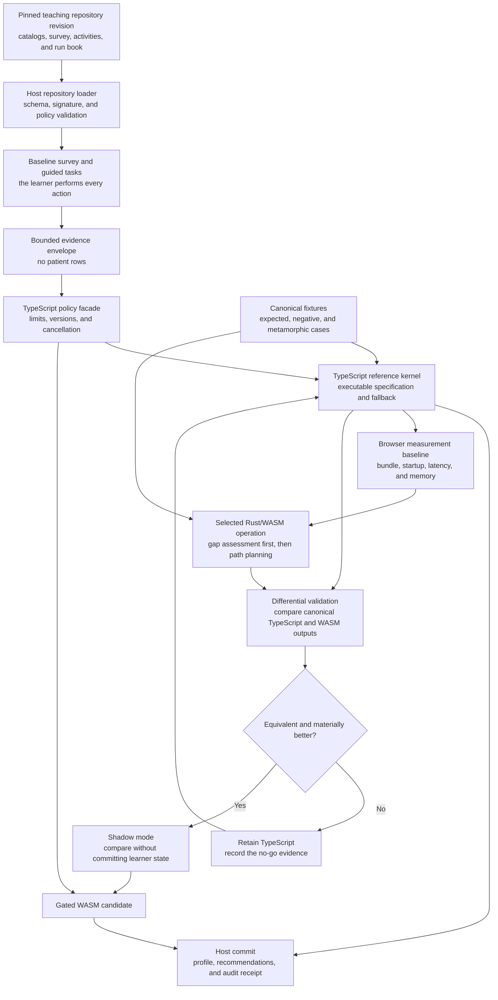

# Adaptive learning kernel plan

Status: proposed architecture and delivery plan; no implementation authorized
by this document  
Date: 2026-09-21  
Initial source review: CDC GitLab
`adaptive-learning/adaptive-learning-prototype` at revision `6aceede`  
Audience: Epi Info AI maintainers, adaptive-learning maintainers, curriculum
authors, security/privacy reviewers, and field epidemiology instructors

## 1. Decision summary

Epi Info AI should integrate adaptive learning through two deliberately
separate products:

1. **`epi-learning` kernel** — deterministic, versioned, tested application
   code distributed only with an Epi Info AI release; and
2. **adaptive teaching repositories** — inert, revision-pinned curricula and
   evidence definitions distributed from governed GitLab repositories and
   mirrored to GitHub.

Teaching repositories must not install JavaScript, Python, WebAssembly,
Workers, models, or arbitrary SPARQL. They may supply declared data, ontology,
SHACL shapes, query fixtures, capability definitions, lessons, assessments,
runbooks, expected aggregate outputs, and provenance. The application validates
those artifacts and passes typed plans to the installed kernel.

This separation preserves the current teaching-repository trust boundary while
allowing instructors to publish or revise teaching content without changing
the application. Kernel upgrades follow the normal Epi Info AI release,
security review, rollback, and compatibility process.

## 2. Why this is useful for Epi Info AI

The first Epi Info use case is not a general learning-management system. It is
an evidence-based guide that helps a learner acquire and demonstrate Epi Info
capabilities while working through a teaching project.

For example, a foodborne investigation repository can declare capabilities
such as:

- inspect a project and its data dictionary;
- run and interpret a data-quality report;
- construct a frequency table and stratified table;
- recode age into governed groups;
- create and interpret an epidemic curve;
- map cases without disclosing sensitive locations; and
- explain the analytical choices and limitations.

The runbook still requires the learner to perform each action. The kernel may
recommend the next lesson, diagnostic, practice activity, or review step, but
it must not click controls, run analysis, or mark a capability achieved merely
because the learner opened or completed content.

## 3. Source-prototype assessment

The reviewed adaptive-learning prototype provides valuable domain assets:

- an OWL/RDFS ontology for capabilities, role requirements, learning assets,
  prescriptions, evidence, forecasts, simulations, and longitudinal learner
  graphs;
- SHACL and SHACL-SPARQL constraints;
- competency questions covering targets, evidence, gaps, pathways, transfer to
  practice, program needs, forecasting, and learning-objective mapping;
- a proposed mathematical foundation that separates observation, capability
  estimate, forecast, and readiness decision;
- a local PowerPoint-analysis and objective-to-content mapping workflow;
- a local-model boundary using llama.cpp;
- example RDF/TriG data and a file-based RDFLib validation path; and
- a proposed migration from RDFLib files to Oxigraph named graphs and a
  controlled graph service.

The reviewed checkout is still a proof of concept:

- the frontend is primarily a Next/React/Vinext demonstration rather than a
  reusable kernel package;
- several learner calculations and personas are embedded in the UI;
- Oxigraph persistence and executable competency-query fixtures are planned,
  not implemented;
- the Python mapping bridge and local llama.cpp process do not fit the current
  static browser/Pages deployment;
- no GitLab or GitHub CI configuration was present in the reviewed revision;
- no repository license file was found; and
- the local checkout contains in-progress changes that are not part of the
  reviewed GitLab revision.

Consequently, Epi Info AI should consume reviewed concepts and contracts, not
copy the prototype application wholesale. Reuse or redistribution is blocked
until the adaptive-learning repository has an approved license and asset
provenance statement.

## 4. Non-goals for the first version

Version 0.1 will not:

- replace an LMS, competency-management system, or HR system;
- issue employment, deployment, credentialing, or readiness decisions;
- call a progress index a readiness probability;
- infer expert status from course completion or self-report;
- upload learner history to GitLab, GitHub, or a central training store;
- train or fine-tune a model on learner activity;
- ingest operational surveillance records as learning telemetry;
- allow a model to write learner evidence directly;
- execute repository-provided code or arbitrary SPARQL;
- expose one learner's record to another learner or instructor without an
  explicit authorized workflow; or
- make the application depend on a Python service, external model server, or
  network connection for ordinary learning guidance.

## 5. Architectural boundary

```text
Teaching repository or project package
  ontology + shapes + capabilities + lessons + runbook + assessments
                         |
                         v
             Epi Info AI policy facade
       verify revision/hash/license/schema/compatibility
       resolve active project + learner consent + privacy class
                         |
                         v
              typed LearningPlan request
                         |
                         v
        dedicated browser Worker: epi-learning
  validate -> estimate -> assess gaps -> plan -> explain
                         |
                         v
       result + diagnostics + deterministic receipt
                         |
                         v
         host review -> local learner record commit
       UI/runbook renders; learner performs the action
```

The host owns UI, project state, OPFS, encryption, repository installation,
authorization, consent, localization, history, and presentation. The kernel
owns only deterministic learning-domain computation over bounded typed input.

The kernel cannot fetch the network, inspect arbitrary project files, mutate a
project, operate the Epi Info UI, execute Epi Info programs, or write OPFS. It
returns proposals and evidence assessments. The host decides what may be
displayed or committed.

## 6. Kernel versus teaching content

| Concern | Application/kernel release | Teaching repository |
| --- | --- | --- |
| TypeScript/Worker/WASM executable code | Yes, after application review | Prohibited |
| Operation registry and JSON schemas | Yes | Declares compatible versions only |
| Ontology vocabulary | Bundled compatibility floor | Pinned, validated extension/profile |
| SHACL shapes | Validator-supported floor | Pinned data-only shapes within profile |
| Capability and role targets | Schema and policy validation | Yes |
| Lessons, assessments, runbooks | Rendering and event contracts | Yes |
| Synthetic teaching data and Epi programs | Validation/execution boundary | Yes |
| Learner record | Local encrypted/user-controlled storage | Never |
| Model files or remote API credentials | Separate governed model facility | Prohibited |

An installed teaching repository cannot upgrade the kernel. A repository that
requires unsupported kernel or ontology versions remains installable only as
documentation, or fails compatibility review before activation.

## 7. Proposed versioned contracts

The first contracts should be TypeScript discriminated unions mirrored by JSON
Schema fixtures.

```ts
type LearningOperationV01 =
  | "learning.catalog.inspect"
  | "learning.evidence.validate"
  | "learning.profile.estimate"
  | "learning.gap.assess"
  | "learning.path.plan"
  | "learning.action.explain";

interface LearningPlanV01 {
  schema: "epi-learning-plan/0.1";
  id: string;
  operation: LearningOperationV01;
  kernelVersion: string;
  ontologyProfile: string;
  teachingRevision: string;
  projectRevision: string;
  learnerRecordRevision?: string;
  inputs: readonly LearningInputRefV01[];
  policy: LearningPolicyRefV01;
  limits: LearningLimitsV01;
}

interface LearningResultV01 {
  schema: "epi-learning-result/0.1";
  planId: string;
  status: "succeeded" | "cancelled" | "rejected" | "failed";
  proposals: readonly LearningProposalV01[];
  diagnostics: readonly LearningDiagnosticV01[];
  receipt: LearningReceiptV01;
}
```

Unknown operations, properties, evidence types, policy versions, or ontology
profiles fail closed. Policy thresholds and weights are data with provenance;
they are not constants hidden in UI code.

### Initial operation meanings

| Operation | Bounded purpose |
| --- | --- |
| `learning.catalog.inspect` | Validate and summarize declared capabilities, prerequisites, lessons, assessments, and compatibility without learner data |
| `learning.evidence.validate` | Validate an evidence event's source, capability binding, stage, provenance, and allowed fields |
| `learning.profile.estimate` | Produce a versioned capability estimate from allowed evidence under an explicit deterministic policy |
| `learning.gap.assess` | Compare estimates with governed targets using achieved/below-target/unknown states |
| `learning.path.plan` | Propose an ordered, bounded set of lessons, diagnostics, practice, or review actions |
| `learning.action.explain` | Return the evidence, target, prerequisites, policy, and uncertainty supporting one proposal |

Forecasting, intervention optimization, coach discovery, cross-learner
analytics, and calibrated readiness remain outside v0.1.

## 8. Evidence contract

The first Epi Info evidence model should capture learning-relevant events, not
patient data or raw screen telemetry.

Minimum fields:

- opaque local learner identifier;
- teaching repository ID, version, and immutable revision;
- project and runbook revision;
- capability and activity identifiers;
- evidence stage: self-report, completion, knowledge check, simulation, or
  reviewed practice;
- bounded outcome and rubric result;
- evidence source and source revision;
- timestamp and optional expiry/refresh interval;
- provenance/dependence group so one event is not counted several times;
- review state and reviewer role where human review is required; and
- schema, estimator, and policy versions.

The event must not contain record values, patient identifiers, coordinates,
free-form command history, arbitrary SQL/SPARQL, access tokens, or uploaded
source documents. If a Classic Analysis action contributes evidence, record an
allow-listed command kind, compatible dataset fingerprint, validation result,
and aggregate expected-output comparison—not the complete command when it may
contain identifying literals.

Learning completion is not automatically practice evidence. A forecast is not
evidence. Unknown evidence remains unknown rather than becoming zero or fail.

## 9. Mathematical floor

V0.1 should implement only the deterministic portion of the reviewed
mathematical proposal:

- normalized capability estimates with explicit evidence source;
- governed targets and optional importance weights;
- lower and upper uncertainty bounds supplied by a declared policy;
- three states: target achieved, below target, and unknown;
- non-compensatory gates for declared critical capabilities;
- planning gap and conservative decision gap kept distinct; and
- a capability progress index labelled as progress, never readiness
  probability.

The prototype's proposed uncertainty values, latent anchors, weights, and
forecast increments are not validated parameters. They may be fixtures in a
clearly labelled synthetic demonstration, but they cannot become Epi Info
defaults without program ownership, evidence, calibration, and subgroup review.

## 10. Graph and ontology strategy

The adaptive ontology remains the semantic source, but the kernel API must not
depend on one RDF engine.

### Publication-time validation

GitLab and GitHub CI should use RDFLib/pySHACL and a pinned Oxigraph release to:

- parse all Turtle/TriG;
- run SHACL Core and approved SHACL-SPARQL constraints;
- execute version-controlled competency queries;
- compare ordered golden results;
- prove named-graph isolation;
- reject placeholder namespaces in releases;
- verify provenance and language tags; and
- emit validation evidence and dependency versions.

### Browser runtime

The first browser slice should not make Oxigraph a prerequisite. Convert the
validated teaching profile at publication time into bounded canonical JSON
indexes for the v0.1 operations. Retain the original RDF, shapes, and query
fixtures as inspectable teaching artifacts.

A later architecture spike may compare Oxigraph/WASM with an RDF/JS engine in a
dedicated Worker. Adoption requires acceptable bundle size, CSP compatibility,
offline behavior, cancellation, memory bounds, named-graph correctness, and
query parity. Browser-authored arbitrary SPARQL remains prohibited regardless
of engine choice.

## 11. Browser execution and storage options

No single browser engine should own semantic validation, learner persistence,
adaptive decisions, and aggregate evaluation. Those workloads have different
trust, lifecycle, and performance requirements.

| Option | Model/query | Browser persistence | Proposed Epi Info role | Decision |
| --- | --- | --- | --- | --- |
| Custom `epi-learning` Rust/WASM | Typed operations over canonical JSON | Host-controlled OPFS | Deterministic evidence, gap, pathway, and explanation kernel | Preferred kernel after a TypeScript contract-first implementation |
| SQLite WASM | Relational/SQL | OPFS support | Transactional learner events, policy versions, receipts, and installed-curriculum state | Preferred local system of record; architecture spike required |
| DuckDB-Wasm | Analytical SQL and Arrow | File-backed or host-managed | Aggregate curriculum evaluation and privacy-reviewed instructor analytics | Reuse the existing Epi Info integration; do not make it the transactional learner store |
| Oxigraph WASM | RDF datasets and SPARQL | In-memory browser binding; host serialization required | Optional ontology exploration and competency queries | Preferred semantic-engine spike |
| CozoDB WASM | Relational graph and Datalog | Browser build is memory-only | Recursive prerequisite and pathway experiments | Research alternative only |
| Kuzu-Wasm | Property graph and Cypher | Browser/in-memory modes | Large property-graph exploration | Do not adopt; the upstream project was archived in 2025 |
| Pyodide with RDFLib/pySHACL | Python RDF, inference, and SHACL | Pyodide filesystem plus host bridge | JupyterLite/browser validation laboratory | Validation-only spike; too heavy for ordinary startup |

### Recommended hybrid

```text
Teaching repository RDF + SHACL
            |
            | GitLab/GitHub publication CI
            v
RDFLib + pySHACL + pinned Oxigraph validation
            |
            v
canonical JSON capability and activity indexes
            |
            v
custom epi-learning Worker
            |
            +-- SQLite WASM/OPFS: learner events and receipts
            +-- Oxigraph WASM: optional bounded semantic queries
            +-- DuckDB-Wasm: aggregate evaluation and comparison
```

The initial kernel should be pure TypeScript so contracts and expected behavior
can stabilize before a language migration. Move deterministic algorithms to
Rust/WASM only when shared Rust primitives, performance measurements, or a
smaller audited implementation justify the added build and release surface.

SQLite and DuckDB receive only application-authored, parameterized operations.
Oxigraph receives allow-listed query templates and explicit named graphs.
Teaching repositories and models cannot submit arbitrary SQL, SPARQL, Cypher,
Datalog, or code to any engine.

### Required architecture spikes

Each candidate runs in a dedicated Worker and must be tested on the lowest
supported field hardware and GitLab/GitHub Pages:

1. **SQLite WASM/OPFS:** transactions, schema migration, quota exhaustion,
   multi-tab ownership, encrypted export, crash recovery, and `.epiax`
   round-trip.
2. **Oxigraph WASM:** Turtle/TriG loading, named-graph isolation, SPARQL parity,
   canonical export, cancellation by Worker termination, memory limits, bundle
   paths, CSP, and offline reload.
3. **DuckDB-Wasm:** bounded aggregate queries over de-identified learning-event
   projections without exposing row-level learner records.
4. **Pyodide validation lab:** exact RDFLib/pySHACL fixture parity, initial and
   cached download size, startup time, memory use, and offline preparation.

Successful execution does not select an engine. A spike must demonstrate a
material capability that is not simpler or safer through canonical JSON and
the typed kernel.

## 12. TypeScript-to-WASM spike strategy

The TypeScript implementation is the executable specification. Rust/WASM is a
candidate implementation of selected deterministic operations, not a rewrite
of the UI, repository loader, learner store, or policy facade.

### Visual implementation path



The main path keeps repository content inert, gives the host control of policy
and persistence, and leaves TypeScript as the reference and fallback. The
lower path permits a WASM operation to advance only after fixture parity,
browser measurement, differential validation, and a non-committing shadow
period.

### Step 0 — freeze scope and invariants

Record these decisions before code:

- first audience and approved foodborne capability vocabulary;
- baseline-survey instrument and mapping-policy versions;
- operations in scope: catalog inspection, evidence validation, profile
  estimation, gap assessment, path planning, and explanation;
- fields that may cross the Worker boundary;
- canonical sorting, numeric precision, missing/unknown semantics, and error
  codes;
- resource ceilings and supported browser/device floor; and
- quantitative go/no-go criteria for bundle size, startup, latency, memory,
  determinism, and maintenance cost.

The following invariants apply to both engines:

- no network, clock, randomness, ambient file access, or UI access inside the
  computation;
- identical inputs and versions produce the same canonical result content;
- unknown is distinct from zero, false, below target, and missing data;
- strengths cannot offset a declared critical capability shortfall;
- self-report cannot establish Expert or operational readiness;
- learner and patient identifiers never enter aggregate diagnostics; and
- cancellation or failure cannot commit partial learner state.

Deliverable: a reviewed operation matrix and written equivalence rules.

### Step 1 — create implementation-neutral fixtures

Build fixtures before either engine:

1. canonical foodborne capability, prerequisite, activity, and target catalogs;
2. two synthetic baseline surveys representing a new learner and an
   experienced programmer;
3. self-report, knowledge-check, synthetic-task, stale, conflicting,
   dependent, and not-assessed evidence cases;
4. expected provisional profiles, three-state gaps, next actions,
   explanations, and receipt content;
5. invalid schema, unknown identifier, cycle, over-limit, duplicate evidence,
   and cross-learner negative cases; and
6. metamorphic expectations, such as stronger independent evidence never
   increasing uncertainty under the same policy.

Fixtures contain no real learner or surveillance data. Expected outputs are
hand-reviewable JSON committed independently of either implementation.

Deliverable: `wasm/tests/fixtures/learning/foodborne-foundation/` with source,
expected, negative, and metamorphic cases.

### Step 2 — implement the pure TypeScript reference kernel

Implement one operation at a time under `wasm/app/learning/`:

1. `contracts.ts` and matching strict JSON schemas;
2. `canonical-json.ts` for sorting and receipt digests;
3. `catalog.ts` for IDs, prerequisites, cycles, compatibility, and limits;
4. `evidence.ts` for allowed evidence stages, provenance, dependence, and
   recency;
5. `baseline-survey.ts` for deterministic branching and provisional mappings;
6. `profile.ts` for capability-specific estimates and uncertainty state;
7. `gaps.ts` for achieved/below-target/unknown and critical gates;
8. `pathway.ts` for bounded prerequisite-aware next-action selection;
9. `explanations.ts` for structured reasons, never generated prose; and
10. `receipts.ts` for versions, hashes, effective policy, diagnostics, and
    terminal status.

These modules are pure functions. They do not access DOM, storage, fetch,
Workers, current time, random numbers, Epi Assist, or project globals. The host
supplies timestamps only after computation; timing metadata is excluded from
the deterministic content digest.

Deliverable: all golden fixtures pass directly against TypeScript.

### Step 3 — prove the reference behavior

Add three test layers:

- **example tests** reproduce every reviewed fixture;
- **generated/property tests** vary levels, targets, uncertainty, prerequisites,
  evidence order, and limits; and
- **metamorphic tests** verify ordering invariance, duplicate/dependence
  handling, gate behavior, and deterministic canonicalization.

Every error maps to a stable Epi-owned code. Tests inspect the result and
receipt rather than matching incidental exception text.

Deliverable: the TypeScript engine becomes the reference oracle, not yet the
production learner feature.

### Step 4 — add the TypeScript Worker boundary

Create `learning-worker.ts` and `kernel-client.ts` using versioned messages:

```text
initialize -> ready
request(id, plan, bounded inputs)
progress(id, phase, completed?, total?)
result(id, result + receipt)
cancel(id) -> terminate Worker in v0.1
error(id, stable code + bounded detail)
```

The host validates the outer schema and asset grants before Worker creation.
The Worker independently validates operation-specific inputs. Timeout,
cancellation, crash, malformed response, project revision change, and digest
mismatch leave learner state unchanged.

Deliverable: the same fixtures pass through the real browser Worker.

### Step 5 — complete one baseline-survey vertical slice

Connect only the synthetic foodborne survey:

1. install or load the inert survey artifact;
2. render accessible questions from its declarative schema;
3. pause, resume, review, and submit synthetic responses;
4. create self-report evidence events;
5. run profile, gap, path, and explanation operations in the TypeScript Worker;
6. display provisional results and the proposed validation task;
7. require the learner to perform the task in the existing Epi Info UI; and
8. commit stronger evidence only after deterministic result comparison or the
   required review.

Use a simple host-managed test record first. SQLite selection remains a
separate storage decision so database integration cannot obscure kernel
behavior.

Deliverable: a browser acceptance path with no Rust dependency.

### Step 6 — establish the measurement baseline

Measure the TypeScript Worker on supported desktop and constrained field-device
profiles:

- built bytes transferred and cached;
- cold and warm Worker initialization;
- per-operation median and tail latency;
- peak practical graph/catalog size before rejection;
- memory proxy and Worker-crash behavior;
- cancellation and restart time;
- offline reload; and
- GitLab Pages versus GitHub Pages behavior.

Record the fixture revision, browser, hardware class, build revision, and limits
profile with every measurement. Set WASM success thresholds before measuring
the WASM candidate.

Deliverable: a checked-in TypeScript baseline report.

### Step 7 — create an isolated Rust/WASM spike crate

Do not add adaptive-learning code to the existing `epi-info-table2x2` crate.
Create a separate experimental crate so statistical-kernel compatibility and
learning-kernel dependencies can evolve independently.

The spike begins with two seams:

1. **Gap operation:** TypeScript validates and maps capability IDs to integer
   indexes; WASM receives typed numeric arrays for estimate, bounds, target,
   weight, and gate flags, then returns state, planning gap, decision gap, and
   gate outcome.
2. **Path operation:** TypeScript compiles the canonical capability/activity
   catalog to indexed node and edge arrays; WASM returns an ordered list of
   proposed activity indexes and deterministic reason codes under explicit
   limits.

Keep string parsing, JSON Schema, RDF, learner authorization, storage, receipt
assembly, and UI outside Rust. This creates a narrow ABI and avoids giving the
WASM module raw repository or learner-record access.

Prefer typed arrays and explicit lengths over passing arbitrary JSON into
WASM. If the ABI becomes harder to audit than the algorithm, stop the spike and
retain TypeScript.

The existing CDC device restriction applies: do not run native Cargo builds or
tests locally. GitLab CI builds only the `wasm32` target, records the toolchain
and dependency lock, scans licenses/dependencies, and publishes the `.wasm`
artifact plus SHA-256. Local browser tests consume that reviewed artifact and
must never execute a generated Windows binary.

Deliverable: a non-default, checksummed WASM candidate and ABI document.

### Step 8 — differential and independent validation

Run TypeScript and WASM against identical serialized inputs:

- all golden, negative, boundary, generated, and metamorphic fixtures;
- randomized input order with canonical output comparison;
- minimum/maximum levels and uncertainty boundaries;
- disconnected, branching, diamond, cyclic, and maximum-size prerequisite
  graphs;
- duplicate and dependent evidence;
- cancellation, timeout, corrupt module, unavailable WASM, and Worker crash;
  and
- Chrome, Edge, Firefox, and Safari where supported by project policy.

Gap states, ordering, reason codes, exclusions, and receipt inputs must match
exactly. Any permitted floating-point tolerance is declared by field and cannot
change categorical decisions near a threshold. An independent small reference
calculation verifies critical boundary cases so two implementations cannot
share the same unnoticed error.

Deliverable: a machine-readable equivalence report.

### Step 9 — shadow-mode browser evaluation

Add a development/reviewer feature flag:

- TypeScript remains authoritative and visible;
- the same reviewed input runs through the WASM candidate;
- a local aggregate comparison records match/mismatch, duration, and versions;
- no learner values or raw responses enter general logs; and
- mismatch automatically disables the candidate for that session.

Shadow mode is limited to synthetic fixtures until privacy review approves any
use with real learner responses.

Deliverable: measured browser evidence without changing user-visible results.

### Step 10 — go/no-go decision

Adopt a WASM operation only if it:

- passes semantic and browser equivalence gates;
- improves a predeclared performance, portability, reuse, or audit objective;
- stays within the agreed bundle and memory budgets;
- preserves cancellation and offline operation;
- has a maintainable ABI and dependency/license profile; and
- can be rolled back without migrating learner records or teaching content.

If the only result is similar performance with more build complexity, retain
TypeScript. WASM is not a maturity badge.

Deliverable: an architecture decision record for each operation.

### Step 11 — candidate rollout and rollback

Promote accepted operations individually:

1. reviewer-only feature flag;
2. synthetic demo default with TypeScript fallback;
3. limited pilot with mismatch monitoring;
4. candidate default after named review; and
5. validated only after educational and domain evidence supports the claim.

Keep the TypeScript oracle in tests even after a WASM operation becomes the
runtime default. Kernel selection is recorded in every receipt. A module-load,
integrity, compatibility, or runtime failure falls back only before an
operation begins; it must not silently switch engines mid-operation.

Teaching manifests declare compatible kernel contract versions, not a required
implementation language. The same curriculum must work with either conforming
engine.

## 13. Teaching-repository extension

The current teaching manifest accepts a small fixed set of artifact roles and
its implementation resolves artifacts only from GitHub. The adaptive-learning
work requires a backward-compatible manifest revision and GitLab/GitHub parity.

Proposed data-only roles:

- `ontology` — RDF ontology/profile;
- `constraints` — approved SHACL shapes;
- `capability-catalog` — canonical JSON capability and prerequisite index;
- `learning-activity` — lesson, diagnostic, practice, or assessment metadata;
- `runbook` — learner-executed UI guidance;
- `competency-query` — publication-time query fixture, never browser-executed
  by default;
- `expected-results` — aggregate expected outcomes and tolerances;
- `localization` — translated labels tied to stable identifiers; and
- `validation` — CI evidence and compatibility declaration.

Manifest v2 should add:

- minimum/maximum Epi Info AI and `epi-learning` versions;
- ontology profile and schema versions;
- publisher, maintainers, license per artifact where licenses differ;
- disclosure review and intended audience;
- dependencies on other immutable teaching repositories;
- language/fallback declarations;
- validation status sourced from CI, not publisher prose; and
- a signature/provenance slot for a future curated registry.

GitLab and GitHub source URLs must resolve through host-specific adapters. Both
must use an immutable full commit SHA or signed release digest. Mutable branch
URLs cannot identify an installed revision.

## 14. GitLab/GitHub repository model

### Repositories

Recommended separation:

1. `adaptive-learning-prototype` remains the upstream research and domain
   design repository.
2. `epi-info-ai/adaptive-learning-kernel` contains kernel contracts,
   implementation, validation fixtures, and release evidence, or those modules
   remain in the Epi Info AI monorepo until the package boundary is stable.
3. Each publishable curriculum uses a data-only repository such as
   `epi-info-ai/teaching-foodborne-analysis` or
   `epi-info-ai/teaching-measles-surveillance`.
4. A curated `epi-info-ai/teaching-catalog` lists reviewed immutable releases.

Avoid making a personal GitHub repository the authoritative release source.
CDC GitLab should be the governed source of truth; the `epi-info-ai` GitHub
organization should receive a reproducible mirror suitable for public access,
Pages, and external teaching use.

### Publication flow

```text
CDC GitLab merge request
  -> license/provenance/privacy review
  -> schema + RDF + SHACL + query validation
  -> Epi program and browser acceptance tests
  -> accessibility/localization/offline checks
  -> generate canonical indexes, manifest, hashes, SBOM, evidence
  -> immutable GitLab release and Pages catalog
  -> mirror exact commit/tag to GitHub
  -> GitHub Actions independently revalidate bytes and results
  -> GitHub Pages publishes the same catalog/docs
  -> cross-host digest comparison must match
```

The mirror job must use protected CI credentials and must never embed a token
in a repository URL, artifact, log, Pages bundle, or teaching manifest. A
GitHub release is published only after the GitLab release succeeds. A failed
mirror or digest mismatch leaves the prior public catalog active.

## 15. Initial learner baseline survey

Epi Info AI should offer an optional internal baseline survey titled **Assess
my Epi Info experience**. It is a versioned evidence-collection activity, not a
readiness examination or employee-performance rating.

The survey has four purposes:

1. identify the learner's goals and relevant Epi Info workflows;
2. record a provisional self-assessment with behavioral anchors;
3. identify capabilities that need a short diagnostic or guided practice; and
4. select a useful starting point without forcing experienced users through
   beginner material.

### User workflow

1. The learner opens the assessment from **Help > Learning and Practice** or
   from an installed teaching project's first runbook step.
2. Epi Info AI explains the purpose, what is stored, where it is stored, how to
   delete or export it, and that the result is not operational readiness.
3. The learner chooses **Start**, **Not now**, or **Use a blank profile**.
4. A short common core is followed by goal-dependent branches.
5. Before submission, the learner reviews the responses and local-storage
   choice.
6. The kernel creates provisional capability assertions with visible evidence
   source and uncertainty.
7. The learner sees a profile organized as **demonstrated**, **reported—needs
   confirmation**, **development opportunity**, and **not assessed**.
8. Epi Info AI offers, but does not automatically run, one or more diagnostics
   or teaching projects that can replace uncertainty with stronger evidence.

The first survey should target eight to twelve minutes. Progress is saved
locally, and the user may revise or reset it. Skipped questions remain `not
assessed`; they are never scored as incorrect.

### Survey domains

The common instrument should cover only broad Epi Info capabilities:

- project, form, field, and data-dictionary concepts;
- data entry, import, identifiers, validation, and data quality;
- descriptive analysis: LIST, FREQ, MEANS, TABLES, and graphs;
- epidemiologic interpretation of frequencies, stratification, estimates,
  confidence intervals, and limitations;
- Classic Analysis programs, saved `.pgm`/`.pgm7` files, and command history;
- mapping, geographic precision, privacy, and offline map use;
- project packaging, encryption, sharing, and offline operation; and
- reproducibility: visible source, expected outputs, provenance, and audit
  history.

Role and goals control later branches. An FETP learner may receive investigation
and interpretation questions; an experienced programmer may receive program,
reproducibility, and migration questions. Role is context for selecting content,
not evidence of capability.

### Response scale

Use behaviorally anchored self-report rather than confidence adjectives alone:

| Response | Learner-facing anchor | Evidence interpretation |
| --- | --- | --- |
| Not used / not assessed | I have not used this workflow, or I prefer not to answer | Unknown; no negative evidence |
| Follow with guidance | I can complete it with a runbook, example, or instructor | Provisional novice self-report |
| Complete familiar tasks | I can complete a familiar example and recognize common output | Provisional advanced-beginner self-report |
| Work independently | I can choose appropriate options, explain the output, and correct common errors | Provisional competent self-report |
| Troubleshoot or teach | I can adapt the workflow, review another person's work, and explain limitations | Provisional proficient self-report requiring confirmation |

No self-report response creates an `Expert` assertion. Expert or coach-ready
status requires defined observed evidence and separate review.

### Question types

The instrument should mix:

- goal and workflow selection, which affects branching but not proficiency;
- behaviorally anchored self-assessment;
- recency and frequency of use;
- experience with specific outputs or tasks;
- short interpretation questions using synthetic outputs;
- optional safe diagnostics performed in a synthetic project; and
- preferences such as language, accessibility, offline use, and available
  learning time, which affect delivery but never lower a capability estimate.

Avoid asking for employer evaluations, medical information, operational
incident details, patient data, exact workplace identifiers, or unrestricted
free text in v0.1.

### Adaptive branching rules

Branching should be deterministic and visible:

- no prior use -> offer foundation material and skip advanced self-rating;
- reported independent/proficient use -> offer a short validation task;
- inconsistent responses -> mark unknown and offer a discriminating task;
- stale experience -> offer a refresher or current-version diagnostic;
- selected goal -> include only relevant optional domains;
- unavailable project or offline asset -> preserve the unanswered state and
  offer a downloadable preparation step; and
- user declines validation -> retain self-report with higher uncertainty.

The survey must never silently shorten itself to manufacture a higher score.

### Baseline result

The result is a set of capability-specific evidence and assertions, not one
average score:

```ts
interface BaselineCapabilityResultV01 {
  capabilityId: string;
  evidenceStage: "self-report" | "knowledge-check" | "synthetic-task";
  provisionalLevel?: "novice" | "advanced-beginner" | "competent" | "proficient";
  decisionState: "reported-needs-confirmation" | "development-opportunity" | "not-assessed";
  uncertainty: "high" | "moderate" | "lower";
  evidenceIds: readonly string[];
  recommendedNextActivityIds: readonly string[];
  policyVersion: string;
}
```

The initial mapping from response to provisional level is a versioned policy,
not an empirically calibrated measurement model. Self-report begins with high
uncertainty. A correctly completed knowledge check or synthetic task may reduce
uncertainty only for the capabilities that task was designed to measure.

### Survey artifact contract

The instrument should be a signed, inert teaching artifact rather than hardcoded
question text. Its manifest declares:

- survey ID, semantic version, immutable source revision, language, and license;
- intended audience and prerequisites;
- question IDs and stable capability mappings;
- response types and behavioral anchors;
- deterministic branching rules;
- evidence stage and allowed output fields;
- scoring/mapping policy version;
- expected duration and accessibility metadata;
- retention and disclosure notice version; and
- validation fixtures for every branch.

Installed survey content cannot provide JavaScript or an expression language.
The application evaluates a bounded declarative rule schema.

### Should the Classic Analysis language run the survey?

It is technically possible to prototype a questionnaire with the current
programming-language building blocks:

- `DEFINE` and `UNDEFINE` can manage session variables;
- typed `DIALOG` variants can collect text, yes/no, date/time, and bounded-list
  responses;
- `IF`/`ELSE` can implement branches;
- `ASSIGN` can derive provisional values; and
- `WRITE` can export selected results as a user-initiated browser download.

That is useful evidence that Epi Info programs can express an interactive
questionnaire. It is not the right primary runtime for the learner baseline.

The authoritative survey should use the declarative survey artifact and reuse
the Form Designer/Enter Data control and validation components through a
separate learning UI. Survey responses are learner-record evidence, not rows in
the active epidemiologic project form.

Using a `.pgm`/`.pgm7` program as the system survey would create avoidable
problems:

- installed teaching programs are intentionally visible, manually reviewed,
  and never auto-executed;
- session variables and sequential modal dialogs are a weak basis for
  pause/resume, review, backward navigation, and reassessment history;
- program text is harder to localize, validate for accessibility, and compare
  between instrument versions;
- a failed or cancelled program could leave ambiguous partial state;
- `WRITE` is a browser download, not an atomic learner-record transaction;
- mixing learner answers with project records risks accidental disclosure or
  analysis; and
- adding survey-only behavior to Classic commands would weaken command-parity
  work with legacy Epi Info.

The programming language may still support three bounded uses:

1. a **synthetic survey command tour** that demonstrates `DEFINE`, `DIALOG`,
   `IF`/`ELSE`, `ASSIGN`, `UNDEFINE`, and `WRITE` without creating an official
   learner profile;
2. an **advanced authoring preview** that generates visible draft program text
   from a survey artifact for teaching and review; and
3. a **compatibility test fixture** proving that survey-like branching and
   cancellation remain correct in the Program Editor.

Those programs must be labelled demonstrations, use synthetic answers, require
explicit execution, and write only to a disposable project/download selected
by the user. They cannot update the authoritative learner record.

Do not add a legacy-looking `SURVEY` command in v0.1. If a future programming
interface is justified, it should be an explicitly new, typed `EPIAI LEARNING`
operation that opens the normal reviewed survey workflow rather than embedding
questionnaire semantics in the Classic interpreter.

### Validation before use

The baseline instrument requires more than software tests:

1. cognitive interviews with FETP learners, experienced Epi Info users, and
   instructors;
2. review of terminology and behavioral anchors against real Epi Info work;
3. pilot testing with synthetic learner records;
4. missingness, completion time, item difficulty, internal consistency where
   appropriate, and branch coverage analysis;
5. comparison of self-report with synthetic-task and instructor-reviewed
   evidence;
6. subgroup and language review for avoidable differential behavior;
7. accessibility and low-connectivity testing; and
8. revision or removal of items that do not support a defined decision.

The UI must show the instrument version and permit reassessment without
overwriting prior evidence. New results supersede earlier assertions through
explicit provenance links.

## 16. First teaching fixture

Use the existing synthetic foodborne investigation before measles or real
workforce data. It already has a dataset, programs, expected outputs, runbook
patterns, and browser workflows.

The first fixture should define five to seven capabilities and a short pathway:

1. inspect field definitions and data quality;
2. identify the onset-date limitation;
3. run a frequency by sex or status;
4. create and interpret an age recode;
5. run a stratified table;
6. produce an epidemic curve; and
7. explain what the outputs do and do not establish.

For each step, include:

- stable capability and activity IDs;
- prerequisites and target level;
- learner instructions;
- the UI action the learner must perform;
- bounded evidence emitted by the host;
- expected aggregate output or rubric;
- failure/unknown handling;
- an explanation fixture; and
- an offline acceptance test.

The acceptance test should demonstrate two synthetic learners with different
evidence histories receiving different next-action proposals. It should also
show that completing a lesson without running or interpreting the analysis does
not satisfy the practice capability.

## 17. Storage, privacy, and synchronization

V0.1 is local-first:

- keep learner records separate from project datasets and teaching content;
- store opaque learner IDs and bounded events in browser storage;
- include learner history in `.epiax` only through an explicit, separately
  described export choice;
- encrypt exported learner records and expose delete/export/reset controls;
- never include learner history in Git repositories or Pages artifacts; and
- do not send learner events to Epi Assist or a model by default.

Cross-browser or central synchronization is a later governed feature. It needs
identity, consent, authorization, retention, correction, deletion, breach,
workforce-policy, data-location, and audit decisions.

### Governed Supabase learner-profile storage

Supabase is a reasonable candidate for synchronized learner profiles because
learner data can be separated by purpose and sensitivity. The recommended
deployment is hybrid rather than treating every profile as either plaintext or
one opaque encrypted object:

```text
Supabase Auth / identity mapping
  └── narrowly accessible account subject → opaque learner ID

Queryable, pseudonymous learner state
  ├── capability levels and uncertainty
  ├── completed activities and prerequisite state
  ├── curriculum, instrument, and policy versions
  └── timestamps and non-sensitive status

Browser-encrypted evidence envelopes
  ├── survey responses
  ├── assessment details
  ├── instructor notes
  └── sensitive AI-interaction evidence

Governance records
  ├── append-only assessment and recommendation receipts
  └── consent, sharing, retention, and withdrawal preferences
```

The storage design should apply all of these controls:

- rely on Supabase platform encryption at rest, but do not mistake it for
  application-level or end-to-end encryption;
- enable Row Level Security on every exposed learner table and grant the
  learner, instructor, administrator, and research roles only the rows and
  operations required for their duties;
- keep names, email addresses, and other direct identifiers outside learning
  state tables, joined only through an opaque learner ID;
- encrypt sensitive evidence in the browser with authenticated encryption,
  initially AES-GCM, before it crosses the network;
- use a distinct data-encryption key per learner or governed profile scope,
  store only a wrapped form of that key, and never store its plaintext beside
  the ciphertext;
- define an explicit cross-device recovery and organizational key-escrow
  policy before enabling synchronized encrypted evidence;
- keep algorithm, format, key-version, nonce, and authenticated-context
  metadata with each encrypted envelope so migrations and integrity checks are
  possible;
- expose export, correction, deletion, consent withdrawal, and retention
  controls; and
- audit both successful and denied access without placing decrypted learner
  content in logs.

The queryable learner state must contain only the minimum data needed for
adaptive recommendations and instructor workflows. Raw survey answers,
free-text notes, and detailed assessment evidence remain encrypted. Approved,
de-identified aggregates may be produced through a separate governed process;
they must not be reconstructed from broadly accessible identity-linked rows.

A stricter synchronization-only deployment may encrypt the entire learner
profile in the browser. In that mode Supabase stores opaque blobs and cannot
filter cohorts, calculate progress, or support instructor dashboards without
an authorized client or service decrypting the profile elsewhere. This is a
valid privacy choice, but it is a different product capability and must be
declared by the deployment profile.

Supabase Vault is appropriate for operational secrets, not as the primary
bulk learner-record store. Row Level Security remains mandatory for encrypted
columns because encryption does not replace authorization. The browser must
never receive a Supabase service-role or secret key. See the Supabase guidance
for [securing data](https://supabase.com/docs/guides/database/secure-data) and
[Vault](https://supabase.com/docs/guides/database/vault).

Fine-tuning on learner history is a separate research protocol, not an
automatic consequence of synchronization. Raw learner profiles must never be
sent directly into training. Any approved use requires purpose limitation,
consent, minimization, de-identification, sampling, bias analysis, provenance,
opt-out or withdrawal handling, and model-governance review.

## 18. Local AI role

IBM Granite or another approved model may later propose:

- mappings between learning objectives and content fragments;
- candidate capability tags;
- plain-language explanations of a deterministic plan; or
- draft assessment or simulation content for human review.

Every model proposal must record model family/version, quantization, prompt
template/version, source hashes, generation parameters, and review decision.
Model output never becomes approved ontology content, evidence, a learner
estimate, or an executable action without deterministic validation and the
required human review.

Remote foundation-model gateways are an optional deployment profile with an
explicit data-disclosure preview. They are not part of the browser-local v0.1
kernel.

## 19. Proposed repository shape

```text
wasm/app/learning/
  contracts.ts
  schemas/
  operation-registry.ts
  canonical-json.ts
  policy.ts
  evidence.ts
  profile.ts
  gaps.ts
  pathway.ts
  explanations.ts
  receipts.ts
  kernel-client.ts
  baseline-survey.ts
  adapters/sqlite-record-store.ts
  adapters/oxigraph-query.ts
wasm/demo/
  learning-worker.ts
wasm/learning-rust/             # experimental, isolated WASM spike crate
  Cargo.toml
  src/lib.rs
  ABI.md
wasm/tests/fixtures/learning/
  foodborne-foundation/
  baseline-survey/
  invalid-catalogs/
  privacy-boundaries/
wasm/docs/design/
  adaptive-learning-kernel.md
```

Pure deterministic modules should precede Worker integration. Rust/WASM is not
required for v0.1 unless measurements or shared statistical primitives justify
it. If Rust is later used, the TypeScript facade and JSON contracts remain the
public boundary.

## 20. Delivery phases

### Phase 0 — governance and upstream baseline

- [ ] Assign product, curriculum, ontology, privacy, and mathematical-policy
  owners.
- [ ] Add an approved license and third-party/asset provenance to the upstream
  adaptive-learning repository.
- [ ] Tag a clean upstream baseline; do not integrate an uncommitted checkout.
- [ ] Decide whether the kernel begins in the Epi Info AI monorepo or a separate
  repository.
- [ ] Approve opaque identifier, learner-consent, retention, and export rules.
- [ ] Classify the mathematical parameters as fixtures, governed policy, or
  validated model parameters.

Exit: a licensed immutable source revision and named decision owners exist.

### Phase 1 — contracts and foodborne fixture

- [ ] Define JSON schemas for plans, results, evidence, policy, receipts, and
  canonical capability catalogs.
- [ ] Define the baseline-survey artifact, response, branching, and result
  schemas.
- [ ] Define the manifest-v2 extension and GitLab/GitHub URL adapters.
- [ ] Author the synthetic foodborne capability/pathway fixture.
- [ ] Author two synthetic baseline profiles and all survey branch fixtures.
- [ ] Author an optional synthetic `.pgm7` survey command tour to test the
  existing interactive command set without updating learner records.
- [ ] Produce expected proposals and negative/privacy fixtures.
- [ ] Review terminology with Epi Info users and FETP instructors.

Exit: the complete fixture is hand-auditable without executable kernel code.

### Phase 2 — deterministic kernel

- [ ] Implement catalog inspection, evidence validation, gap assessment,
  pathway planning, and explanation as pure TypeScript.
- [ ] Implement canonical JSON and deterministic receipt digests.
- [ ] Add unknown/conflicting/dependent/stale evidence cases.
- [ ] Prove that non-critical strengths cannot offset a gated shortfall.
- [ ] Label all uncalibrated outputs correctly.

Exit: unit and property tests reproduce the reviewed foodborne fixtures.

### Phase 3 — browser Worker and local record

- [ ] Add a lazy-loaded dedicated Worker with timeout, cancellation, limits,
  structured errors, and clean restart.
- [ ] Complete the SQLite WASM/OPFS spike and select or reject it against a
  simpler host-managed record store.
- [ ] Add an atomic host-side learner-record transaction.
- [ ] Add export, delete, reset, and encrypted-backup workflows.
- [ ] Ensure project switches and repository removal cannot corrupt learner
  history.

Exit: offline replay produces equivalent proposals and receipts; failures leave
the prior record unchanged.

### Phase 4 — teaching repository integration

- [ ] Extend the loader without weakening the v1 trust boundary.
- [ ] Add GitLab and GitHub immutable-source adapters.
- [ ] Validate dependencies, hashes, sizes, licenses, schema versions, and
  kernel compatibility before activation.
- [ ] Install atomically and retain source/revision labels offline.
- [ ] Add side-by-side update review and rollback.

Exit: the same teaching revision installs from GitLab and GitHub with identical
artifact hashes and behavior.

### Phase 5 — learner UI and runbook integration

- [ ] Add an opt-in learner panel showing target, evidence, uncertainty, next
  action, and explanation.
- [ ] Add the accessible baseline survey, review screen, pause/resume, reset,
  and reassessment history.
- [ ] Reuse accessible form controls while keeping survey state outside the
  active epidemiologic project dataset.
- [ ] Let project runbooks bind steps to stable learning activities.
- [ ] Require learners to execute the substantive Epi Info action.
- [ ] Keep instructor/admin functions separate from learner controls.
- [ ] Add keyboard, screen-reader, responsive, localization, and low-bandwidth
  acceptance tests.

Exit: two synthetic learners complete the foodborne pathway and receive
auditable, different proposals without automation of their actions.

### Phase 6 — RDF publication pipeline

- [ ] Pin RDFLib, pySHACL, and Oxigraph validation versions.
- [ ] Convert minimum competency questions to `.rq` fixtures with golden
  results.
- [ ] Generate canonical browser indexes from validated named graphs.
- [ ] Test graph isolation and prevent learner data from entering publication
  artifacts.
- [ ] Conduct the Oxigraph WASM and Pyodide validation-lab spikes separately.

Exit: RDF, canonical JSON, and expected query results are mutually consistent.

### Phase 7 — model-assisted authoring

- [ ] Port the local content-mapping contract, not the Python service itself.
- [ ] Add source/prompt/model receipts and a human approval queue.
- [ ] Test malformed, incomplete, biased, and prompt-injected content.
- [ ] Keep authoring inference outside the deterministic learner kernel.

Exit: model use can be disabled without changing learning-plan results.

### Phase 8 — validation and pilot

- [ ] Conduct security, privacy, accessibility, ontology, statistical, and
  experienced-user review.
- [ ] Pilot with synthetic accounts and synthetic projects first.
- [ ] Evaluate explanation comprehension, false evidence, subgroup behavior,
  abandonment, and instructor override.
- [ ] Calibrate or remove any probabilistic claim that lacks independent
  outcome evidence.
- [ ] Publish limitations and a rollback/revocation process.

Exit: reviewers explicitly approve the candidate scope; successful execution
alone does not establish educational effectiveness or readiness validity.

## 21. CI and release gates

Every kernel or teaching release should fail when any of these checks fail:

- license or provenance missing;
- unpinned dependency, mutable source revision, or hash mismatch;
- executable or undeclared artifact in a teaching repository;
- ontology parse, SHACL, competency-query, or canonical-index mismatch;
- schema incompatibility or unknown operation/property;
- learner/patient identifiers in fixtures, logs, receipts, or Pages output;
- cross-learner graph leakage;
- non-deterministic plan/result digest where determinism is required;
- TypeScript/WASM semantic mismatch or an undeclared field tolerance;
- incorrect unknown, stale, conflicting, or dependent-evidence handling;
- untested survey branch, unstable question/capability ID, or a skipped response
  converted to failure;
- inaccessible learner/runbook interaction;
- offline install/replay failure;
- GitLab/GitHub artifact or Pages version mismatch; or
- SBOM, dependency, secret-scan, or security-policy failure.

Required evidence should include test results, source and output hashes,
dependency versions, manifest validation, browser matrix, accessibility report,
and cross-host digest comparison.

## 22. V0.1 acceptance criteria

V0.1 is a candidate only when:

- the upstream source and every redistributed asset are licensed;
- teaching repositories remain inert and revision-pinned;
- GitLab and GitHub install the same reviewed bytes;
- two foodborne learner fixtures yield the expected different pathways;
- the baseline survey can be declined, paused, resumed, reviewed, reset, and
  repeated without losing provenance;
- self-report never creates an Expert assertion or a readiness decision;
- no patient values or raw identifying command literals enter learning history;
- completion, practice, forecast, and reviewed evidence remain distinct;
- unknown evidence produces an assessment/review action rather than a false
  pass or fail;
- every recommendation has a visible deterministic explanation and receipt;
- cancellation, corrupt content, quota failure, project switch, and repository
  update leave prior learner/project state intact;
- local export/delete/reset and encrypted backup work;
- ordinary guidance works offline without Python, Oxigraph server, or a model;
- every adopted WASM operation has a passing equivalence report, recorded
  engine version, TypeScript test oracle, and tested rollback path; and
- limitations explicitly state that progress is not calibrated operational
  readiness.

## 23. Immediate planning decisions

Before implementation begins, resolve these questions:

1. Who owns capability definitions and target levels for Epi Info users?
2. Is the first audience FETP learners, experienced Epi Info programmers, or
   instructors authoring curricula?
3. Which learner events may be stored locally, and for how long?
4. Will an instructor ever receive learner records, and under what consent and
   authorization model?
5. Which ontology namespace and identifier policy replace the prototype
   placeholder namespace?
6. Does the kernel begin inside the monorepo or as a separately versioned
   package after the contracts stabilize?
7. Which GitLab group and GitHub organization own the teaching catalog and
   release mirrors?
8. What constitutes sufficient evidence for an Epi Info capability: validated
   output, interpretation rubric, simulation, instructor review, or a
   combination?
9. Which baseline domains and behavioral anchors are approved for the first
   FETP and experienced-user pilots?
10. Is SQLite WASM justified for the v0.1 learner record, or is the initial
    event volume small enough for a simpler host-managed OPFS document store?

The recommended next action is Phase 0 followed by a paper-complete foodborne
fixture. No adaptive runtime code should be added until those governance and
contract decisions are recorded.
