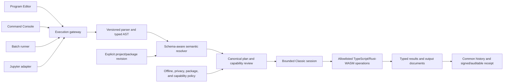

# Command-line and interactive-console branch

## Decision status

This document records the command-line behavior found in the retained Epi Info
Community Edition source and proposes a browser-era roadmap. It does not claim
that desktop Epi Info had a Python-style interactive shell. The legacy batch
entry points are a parity floor; an immediate console, headless runner, and
Jupyter kernel are separately governed new branches.

The implementation rule is simple: every interface must submit source to the
same versioned parser, semantic resolver, typed plan, operation registry,
session, output renderer, and audit history used by the Program Editor. A
console must never become a second interpreter or a route around review.

## Legacy survey

### Finding

Epi Info 7 had command-line automation, but not an interactive `>>>`-style
read-evaluate-print loop (REPL).

Its closest equivalents were:

1. a GUI Classic Analysis Program Editor that ran highlighted source as one
   command/block, or the complete editor contents when nothing was selected;
2. an `Analysis.exe` entry point that accepted a `.pgm7` path, opened the GUI,
   loaded the program, and immediately ran it;
3. application launch switches for opening a particular project, view, record,
   map, canvas, or output target; and
4. a narrow `Config` executable with `get`, `set`, and `dialog` operations for
   permanent variables.

These are useful batch and automation precedents. They are not evidence of a
persistent terminal prompt with incremental input/output, completion, an
execution counter, or a general shell environment.

### Source evidence

| Capability | Retained-source evidence | Interpretation |
|---|---|---|
| Run selection or whole program | `ProgramEditor.btnRun_Click` sends selected text to `OnRunCommand`; otherwise it sends the complete editor to `OnRunPGM` ([ProgramEditor.cs](../../source/Epi-Info-Community-Edition/Epi.Windows.Analysis/Forms/ProgramEditor.cs#L430)) | Familiar interactive execution occurred inside the GUI editor, not at a terminal prompt. |
| One-command execution mode | `programEditor_RunCommand` resets selection state and enables the interpreter's one-command mode ([AnalysisMainForm.cs](../../source/Epi-Info-Community-Edition/Epi.Windows.Analysis/Forms/AnalysisMainForm.cs#L466)) | A bounded immediate-command concept existed internally and can inform a browser console. |
| Whole-program execution | `programEditor_RunPGM` clears session state and submits the complete program ([AnalysisMainForm.cs](../../source/Epi-Info-Community-Edition/Epi.Windows.Analysis/Forms/AnalysisMainForm.cs#L447)) | Program execution and immediate execution had intentionally different session semantics. |
| Batch `.pgm7` launch | `Analysis.exe` locates a `.pgm7` argument and calls `LoadProgramFromCommandLine` ([EntryPoint.cs](../../source/Epi-Info-Community-Edition/Epi.Windows.Analysis/EntryPoint.cs#L26)); the editor reads the file and invokes `RunPGM` ([ProgramEditor.cs](../../source/Epi-Info-Community-Edition/Epi.Windows.Analysis/Forms/ProgramEditor.cs#L168)) | Closest legacy equivalent to `python script.py`; it still starts the Windows application and uses GUI output. |
| Application switches | Enter reads `title`, `project`, `view`, and `record` arguments ([EntryPoint.cs](../../source/Epi-Info-Community-Edition/Epi.Windows.Enter/EntryPoint.cs#L22)); other modules expose similar switches | Useful launch/deep-link precedent, not an analysis language REPL. |
| Argument parser | `CommandLine` parses slash-separated name/value switches into an `ICommandLine` dictionary ([CommandLine.cs](../../source/Epi-Info-Community-Edition/Epi.Windows/CommandLine.cs#L14)) | A Windows-specific launcher contract; do not reproduce its ambiguous string splitting. |
| Permanent-variable utility | `Config get`, `Config set`, and `Config dialog` are implemented in a small executable ([Program.cs](../../source/Epi-Info-Community-Edition/Epi.CommandLine.Config/Program.cs#L17)) | A narrow administrative CLI, not a general Classic Analysis console. |
| Program editor UI | The resources expose **Run Commands**, while command dialogs generate source for the multiline editor ([ProgramEditor.resx](../../source/Epi-Info-Community-Edition/Epi.Windows.Analysis/Forms/ProgramEditor.resx#L1245)) | The learned workflow is source-first and GUI-based. |
| External process execution | Legacy `EXECUTE` can start operating-system processes | This is historical behavior that remains blocked in the browser; it is not a feature to restore through a console. |

The source search found no general terminal window that repeatedly displayed a
primary prompt, accepted arbitrary Classic Analysis commands, printed a result,
and retained an interactive namespace in the manner of Python IDLE. Absence in
the reviewed checkout is not proof about every earlier Epi Info generation, so
experienced-user and archived-manual review remain useful historical checks.

## Terminology

- **Program Editor** — the familiar multiline `.pgm`/`.pgm7` authoring surface.
- **Command console** — a new browser panel for one complete command or block at
  a time, with persistent Classic session state and visible history.
- **Batch runner** — a non-interactive interface that runs a complete validated
  program against an explicitly selected project revision and returns a receipt.
- **Kernel** — the shared language execution service. It owns parsing, planning,
  session state, cancellation, and typed result events; it does not own UI.
- **Jupyter adapter** — a translation layer between Jupyter messages and the Epi
  kernel. It is not a Python translation and does not execute Epi source through
  Python.
- **Operating-system shell** — PowerShell, `cmd`, Bash, or equivalent. Epi Info
  AI does not expose one.

## User needs

The branch should support four related workflows without conflating them:

1. **Learn and explore:** enter a command, inspect the canonical interpretation,
   run it, and immediately see output or an actionable diagnostic.
2. **Develop a reproducible program:** move successful console entries into the
   Program Editor, save them as `.pgm7`, and run the full sequence.
3. **Automate validation:** run a checked-in program against a pinned example
   project in CI and compare typed outputs with expected values/tolerances.
4. **Teach interactively:** use the same language in JupyterLite notebooks while
   retaining command history, receipts, and the browser-local privacy boundary.

## Candidate patterns to adopt and adapt

| Pattern | Adopt | Adapt for Epi Info AI | Do not copy |
|---|---|---|---|
| Python interactive mode | Clear primary and continuation prompts; explicit distinction between interactive input and script execution ([Python interactive mode](https://docs.python.org/3/tutorial/interpreter.html#interactive-mode)) | Use `EPI>` and `...>` only when a typed parser reports a genuinely incomplete block; retain execution IDs and current project/session disclosure | Python expression semantics, `eval`, imports, startup scripts, or access to the host runtime |
| Database query consoles | Visible active data source, run selection, bounded result preview, history, elapsed time, cancel, and export | Show project/form/revision, selection/sort/weight state, estimated operation class, and Epi-specific result documents | Treating Classic Analysis as SQL or exposing unrestricted database connections |
| Notebook/code-console cells | Immutable input/output pairing, execution count, rich MIME results, restart/interrupt, completion, inspection, and history | Map one complete Epi command/block to a cell request and emit typed Epi tables/charts/maps plus a receipt | Hidden out-of-order state, automatic execution on open, or arbitrary JavaScript/HTML output |
| Jupyter messaging | `execute`, `complete`, `inspect`, `history`, `interrupt`, status, display data, and structured errors; `execute_request` already distinguishes silent execution, history, and stop-on-error ([Jupyter execute request](https://jupyter.org/services/interfaces/kernelmessage.iexecuterequest.html)) | Implement a browser-local adapter over the Epi kernel in a dedicated Worker; publish only supported messages and MIME types | Claiming compatibility before notebook round-trip, interrupt, history, and conformance fixtures pass |
| JupyterLite | Static hosting, browser-local kernels, Code Consoles, notebooks, and offline-capable content ([JupyterLite](https://jupyterlite.readthedocs.io/en/stable/)) | Package a custom Epi kernel extension only after the internal kernel contract stabilizes; keep the Epi project/package store authoritative | Making Pyodide the Epi interpreter or requiring Python to run Epi commands |
| Modern editor language services | Incremental parse diagnostics, completion, signature help, hover help, bracket/block matching, and accessible diagnostic navigation | Reuse the Program Editor's CodeMirror language support and schema-aware completion in the console | Completion that invents fields or expands execution authority |
| Package-manager lockfiles and CI runners | Exact input versions/digests, deterministic exit status, machine-readable output, cached immutable dependencies | Pin project/package revision, program digest, AST/operation/kernel versions, locale, seed, and expected-output contract | Ambient working-directory discovery, mutable “latest,” unreviewed downloads, or secret-bearing programs |

## Proposed interaction model

### 1. Browser command console

Add an optional, hideable **Command Console** beside or below the existing
Program Editor. It supplements rather than replaces the familiar editor and
Command Explorer.

Candidate behavior:

- always display the active project, form/dataset, record count, project revision,
  and selection/sort/weight state;
- accept exactly one complete statement or structured block per submission;
- use `Shift+Enter` to execute and `Enter` for a newline while a block is
  incomplete; provide an explicit **Run** button for accessibility;
- parse continuously, but never execute on typing, paste, project open, history
  navigation, package import, or notebook open;
- show canonical source, compatibility classification, requested capabilities,
  and warnings before the first state-changing or export operation;
- append an immutable entry containing execution ID, source, source hash,
  timestamp, duration, status, project revision, typed plan/operation versions,
  output references, and session effects;
- support Up/Down history, reverse search, completion, command help, copy to
  Program Editor, save selection as `.pgm7`, clear visible console, and restart
  session; clearing the view does not erase audit history;
- bound result previews and offer explicit export through the existing reviewed
  browser adapters; and
- make interruption cooperative and honest: “cancel requested” is distinct from
  “cancelled,” and completed effects remain disclosed.

The console must not accept shell escapes, JavaScript, SQL passthrough, URLs,
tokens, filesystem paths beyond explicit browser-selected handles, DLL calls, or
legacy `EXECUTE` process launches.

### 2. Reproducible batch runner

Restore and modernize the legacy `.pgm7` launch use case. Two front ends may use
one batch contract:

- a browser **Run Program Package...** action for a user-selected project/package
  and program; and
- a future installed developer/CI command such as the following *candidate* API:

```text
epi-info-ai run \
  --project foodborne.epia \
  --program command-tour.pgm7 \
  --result result.json \
  --receipt receipt.json \
  --network deny
```

This syntax is illustrative and not implemented. The runner must validate the
entire project/package and program before execution, default to no network, never
overwrite an input, emit stable exit codes and structured diagnostics, write
outputs only to explicit destinations, and produce the same canonical plans,
typed results, and receipts as the browser. Interactive `DIALOG`, file choice,
geocoding, or other human/provider-dependent statements fail with a declared
non-interactive-capability error unless a reviewed input manifest supplies the
required value/provider.

CI should execute only synthetic, public, or disclosure-cleared fixtures. It
must never upload operational surveillance records merely to validate a program.

### 3. JupyterLite Epi kernel

After the console contract stabilizes, implement an `epi-info` JupyterLite kernel
adapter. Jupyter kernels receive execution requests containing source plus
history/stop options, and kernel authors provide language-specific execute and
completion logic. JupyterLite already supports browser-local kernels and Code
Consoles, making it a useful teaching and validation host—not the core Epi
runtime.

Minimum adapter surface:

- kernel information with exact Epi language, AST, operation-registry, and
  package versions;
- execute request/reply with queued/busy/idle state and stop-on-error behavior;
- stream/status/error messages with source locations and stable error codes;
- `display_data`/`execute_result` for allowlisted plain text, sanitized HTML,
  Epi table JSON, chart JSON/SVG, and map-layer/result references;
- completion from grammar, current schema, variables, groups, and compatible
  command options;
- inspection/help from the command registry and manual;
- history scoped to the notebook/kernel session with explicit project binding;
- interrupt and restart, with stale-result rejection; and
- notebook metadata pinning the example project/package digest and expected
  kernel capability range.

Opening or trusting a notebook never grants command authority. Cells remain
visible source; execution is user-initiated; HTML is sanitized; JavaScript MIME
and arbitrary comm targets are disabled unless separately reviewed. Record-level
data must not be embedded in notebook outputs by default.

## Shared kernel architecture



The execution gateway owns mutual exclusion, cancellation, budgets, and stale
result rejection. UI surfaces own presentation only. Statistical operations own
validated calculations, not parsing or UI. Project/package services own data and
artifact access, not implicit command execution.

## Session and history contract

Every interface must use the same explicit session model:

- active project, form/dataset, and immutable source revision/fingerprint;
- current selection, sort, weight, related-data, and output-route state;
- Standard/global/permanent variables and group definitions with declared scope;
- named intermediate/result tables and their provenance;
- locale, time zone, random seed/algorithm, and missing-value rules;
- operation/kernel/package versions; and
- cancellation, warnings, rejected capability requests, and output references.

History records original source and canonical source. It must distinguish verify,
plan, execute, reject, fail, cancel-requested, cancelled, and complete. Secrets
and record values are excluded unless a user deliberately exports a governed
result artifact. AI-generated and human-authored commands travel through the
same history and execution boundary.

## Security and governance requirements

- No interface evaluates source as JavaScript or translates it into an ambient
  host-language expression.
- Parse success is not execution permission. Each typed node must resolve to an
  allowlisted operation and capability policy.
- State-changing operations require a complete validated plan; destructive or
  externally visible effects require preview/confirmation according to policy.
- Workers receive only the minimum data/columns required by the typed plan and
  enforce row, memory, time, output, and recursion limits.
- The browser console has no DOM authority. The batch runner has no implicit
  home/current-directory, credential, process, or network authority.
- Imported programs and notebooks remain inert until explicitly opened,
  validated, and run.
- Package signatures establish identity/integrity, not execution permission.
- All surfaces expose the same compatibility classification: legacy parity,
  adapted browser behavior, new branch, unsupported, or blocked.

## Roadmap

### Phase 0 — contract and corpus

- Freeze this legacy survey with experienced-user/manual review.
- Define a versioned execution-request/result/receipt contract shared by all
  front ends.
- Add console/batch expectations to `COMMAND_SET.md` without changing command
  parity status.
- Select foodborne, matched case-control, cluster, record-linkage, and Check Code
  examples that contain no interactive-only statements for the initial corpus.

Exit: the same source, project fingerprint, and session seed produce the same
canonical plan/result identifiers through a test harness and Program Editor.

### Phase 1 — browser console vertical slice

- Add a hideable console to Classic Analysis using the existing CodeMirror
  language support.
- Support verified `READ`, `LIST`, `FREQ`, `MEANS`, and `TABLES` first, including
  multiline completion detection and schema-aware suggestions.
- Reuse current Output documents and common command history.
- Add copy-to-editor, session restart, cancellation, keyboard/accessibility, and
  mobile layout tests.

Exit: each supported console command has parser, semantic, operation, output,
history, refresh/reopen, offline, and Chromium/Firefox/WebKit workflow evidence.

### Phase 2 — deterministic batch runner

- Extract the UI-neutral gateway and session from browser event handlers.
- Define stable JSON request/result/receipt schemas and exit/error codes.
- Run checked-in `.pgm7` programs without prompts or ambient access.
- Integrate synthetic example runs into GitLab/GitHub CI and JupyterLite
  differential validation.

Exit: batch and browser results match for the same package/program digest, and a
failed/cancelled run leaves inputs intact and emits a complete receipt.

### Phase 3 — JupyterLite kernel adapter

- Implement execute, complete, inspect, history, interrupt, restart, status, and
  allowlisted rich display messages in a Worker.
- Bind notebooks to pinned teaching-project manifests and provide explicit
  rebind/mismatch review.
- Validate cell ordering, restart/replay, offline use, sanitization, output size,
  cancellation, and notebook export/reopen.

Exit: the validation lab runs the command corpus using the Epi kernel without
Python translation and reproduces the browser/batch expected results.

### Phase 4 — governed automation and distribution

- Package the optional batch runner through the approved Epi Info AI software
  release channel with build provenance and an SBOM.
- Add signed example/program packages and curated notebook modules.
- Define organization policy for allowed packages, operations, providers,
  output destinations, and non-interactive inputs.
- Add long-running Worker progress, resource accounting, concurrency limits,
  crash recovery, and supportable diagnostic bundles.

Exit: an administrator can reproduce, audit, pin, revoke, and roll back the
runner/kernel and its teaching packages on connected and restrictive networks.

## Acceptance gates

No console, runner, or kernel is ready for a parity or production claim until:

- the legacy batch behavior and GUI selection behavior have differential or
  experienced-user evidence;
- source parsing, semantic resolution, and operation authorization are identical
  across Program Editor, console, batch, and notebook paths;
- program/session history is deterministic, durable, and value-minimized;
- cancellation, timeout, memory/output limits, failure atomicity, and stale
  results are tested;
- accessibility, keyboard navigation, localization, and narrow-screen behavior
  pass;
- offline behavior and package/project fingerprint mismatches are explicit;
- statistical outputs pass their independent validation contracts; and
- security review confirms that no path exposes an OS shell, arbitrary code,
  credentials, or unrestricted filesystem/network/database access.

## Open decisions

1. Should the first console accept only one AST statement, or any parser-complete
   block such as `IF`, `RECODE`, or future bounded loops?
2. Does a console session persist across page refresh, or restore only after an
   explicit user action from a receipt?
3. Which state changes require per-command confirmation versus a reviewed
   program-level plan?
4. Should the installed batch runner be Rust-native, a packaged browser runtime,
   or both behind the same JSON contract?
5. Which rich output MIME types are safe and sufficient for the initial Jupyter
   adapter?
6. How are permanent variables scoped for a shared or managed workstation?
7. Which legacy command-line switches deserve direct compatibility aliases, and
   which should be replaced by explicit modern options?

## Related documents

- [Programming IDE compatibility inventory](programming-ide-compatibility-inventory.md)
- [Classic command compatibility registry](classic-command-compatibility-registry.md)
- [Teaching repository contract](teaching-repository-contract.md)
- [Legacy capability register](legacy-capability-register.md)
- [`COMMAND_SET.md`](../../../COMMAND_SET.md)
