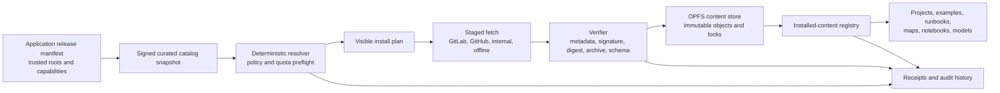

# Package-manager branch

## Decision status

This document proposes a governed package-management capability for Epi Info AI.
It is a **new branch**, not a legacy-parity claim: retained Epi Info source shows
internal module loading, whole-application updating, and project/data packaging,
but not a modern user-facing package registry.

The initial package manager distributes inert, declarative content only. It must
not install TypeScript, JavaScript, Workers, native code, arbitrary WebAssembly,
or new kernel operations. Application and kernel releases remain a separate,
administrator-controlled software supply chain. A valid signature establishes
origin and integrity; it does not grant execution authority.

## Legacy survey and parity floor

| Legacy capability | Retained-source evidence | Meaning for Epi Info AI |
|---|---|---|
| Internal module lifecycle | `IModuleManager` exposes create, attach, detach, and unload operations ([IModuleManager.cs](../../source/Epi-Info-Community-Edition/Epi.Core/IModuleManager.cs#L9)). | Useful internal precedent, not evidence of an end-user registry. |
| Configured modules | Static configuration enumerates known module definitions ([Configuration_Static.cs](../../source/Epi-Info-Community-Edition/Epi.Core/Configuration_Static.cs#L972)). | Legacy modules were application-configured rather than independently published packages. |
| Module startup | `ApplicationManager` creates and attaches configured modules ([ApplicationManager.cs](../../source/Epi-Info-Community-Edition/Epi.Windows/ApplicationManager.cs#L386)). | Modern extensions must not inherit ambient application authority. |
| Fixed application launchers | The menu launches known application executables ([MenuMainForm.cs](../../source/Epi-Info-Community-Edition/Epi.Windows.Menu/MenuMainForm.cs#L440)). | This is a fixed product suite, not a plug-in marketplace. |
| Whole-application update | The desktop menu checks a CDC version feed ([MenuMainForm.cs](../../source/Epi-Info-Community-Edition/Epi.Windows.Menu/MenuMainForm.cs#L231)). | Application updates belong to the release channel, outside content installation. |
| Data transport | The menu exposes Data Packager and Data Unpackager ([EpiInfoMenuManager.cs](../../source/Epi-Info-Community-Edition/Epi.Menu/EpiInfoMenuManager.cs#L302)). | Project exchange informs `.epia` and `.epiax`; it does not imply package execution. |

The historical floor therefore includes recognizable project packaging and a
centrally managed product update. Discovery, dependency resolution, delegated
publishing, signatures, revocation, lockfiles, and reusable teaching modules are
intentional browser-era additions.

## Existing Epi Info AI package-like surfaces

| Surface | Current purpose | Package-manager relationship |
|---|---|---|
| `.epia` | Portable project archive containing declared project artifacts. | Import/export transport; not automatically trusted or installed as software. |
| `.epiax` | Authenticated encrypted project archive. | Confidential transport; encryption does not imply curation or safety. |
| Example-project catalog | Built-in and hosted demo projects. | Candidate source for the first unified content catalog. |
| Teaching repository | Commit-pinned, hash-verified datasets, programs, maps, runbooks, and validation assets. | Closest current precursor to a content package. |
| Offline map package | Project-scoped map data and cache policy. | Governed content with large-size and license constraints. |
| Learning/ML module | Planned lessons, notebooks, models, and evaluations. | A specialized declarative package profile with extra model governance. |
| Application/kernel release | TypeScript UI, Workers, WASM kernels, and schemas. | A separate CI/release process; never installed by the content manager. |

Personal `.epia` and `.epiax` files remain user-controlled project transfers.
They must not acquire registry trust merely from a filename, encryption, or a
successful import.

## Package taxonomy

The manifest should declare one of these artifact types:

- `epi.project`: a reusable project template or worked example;
- `epi.data-transport`: a bounded data/project exchange artifact;
- `epi.teaching-module`: datasets, programs, runbooks, and expected results;
- `epi.learning-module.ml`: teaching content plus allowlisted model artifacts,
  model cards, evaluation evidence, and resource declarations;
- `epi.capability-assets`: curated data/model assets that activate a named,
  application-shipped typed adapter without installing executable code;
- `epi.map-content`: declared spatial layers, styles, and offline map assets; or
- `epi.application-release`: application/kernel software, which is recognized
  by metadata but rejected by the normal content installer.

Profiles may share an archive container and common metadata, but their required
fields, validation gates, size limits, and permitted media types differ.

### First capability-package pilot: Occupational Epidemiology

IOCODE is the reference pilot for `epi.capability-assets`. Core Epi Info AI
retains the parsed seven-field IOCODE contract, field/type validation,
capability lookup, atomic assignment boundary, and audit receipt. The package
would supply the licensed coding model, taxonomy metadata, model card,
synthetic validation corpus, help/teaching material, and exact digests needed
by the application-shipped `io.coder.review/0.1` adapter. It must not supply or
execute JavaScript, a Worker, arbitrary WebAssembly, a .NET DLL, or a remote
endpoint definition.

Installation alone does not run the model or alter a project. At execution,
the user sees the package/model identity and the bounded candidate-review UI.
Removing, revoking, or disabling the package leaves IOCODE source readable but
unavailable with an actionable diagnostic. This pilot exercises package
signing, capability and version resolution, large offline assets, licensing,
validation evidence, revocation, and receipts without weakening the inert
content-manager boundary. See [IOCODE browser adapter assessment](iocode-browser-adapter.md).
The synthetic reference repository is authoritative at
[CDC GitLab](https://git.cdc.gov/epi-info-ai/package-occupational-epidemiology)
and mirrored publicly on
[GitHub](https://github.com/epi-info-ai/iocode-occupational-epidemiology);
its V0.1 manifest explicitly distinguishes approved demonstration import from
unapproved scientific execution.

#### Implemented Phase 1 pilot boundary

The application Help menu now exposes **Capability Packages...** for this one
allowlisted reference profile. It validates the manifest structure before
showing a plan, separately displays installation approval, scientific-execution
approval, signing status, and requested authority, and refuses manifests that
request execution, network access, dependencies, unapproved repositories,
unknown media types, unsafe paths, or executable/model extensions. Installation
fetches only artifacts at the manifest's full 40-character revision, tries the
authoritative GitLab repository and declared GitHub mirror, verifies byte length
and SHA-256 before committing, stores inert files in OPFS, and records a
value-free `installed-inert` receipt in the browser registry.

This is deliberately narrower than the complete Phase 1 roadmap. The pilot has
no general catalog, signature/root verification, uninstall/repair/rollback UI,
quota dashboard, offline bundle import, multi-package resolver, or activation.
Its manifest says `pending-protected-ci`; the UI therefore labels it
integrity-checked rather than signed. Installing changes the IOCODE diagnostic
from package-missing to package-installed/scientific-approval-pending, but never
enables Apply or runtime execution.

The current CDC GitLab package repository is private. Browser deployments do
not receive its developer token or authenticated session. When anonymous raw
manifest retrieval returns the GitLab sign-in page, this allowlisted pilot may
retrieve the byte-identical public GitHub mirror instead and displays the host
actually used. Artifact verification still uses the pinned revision and
declared digests; mirror transport never confers trust.

## Industry patterns to adopt and adapt

| Pattern | Use in this branch |
|---|---|
| [The Update Framework](https://theupdateframework.github.io/specification/draft/) | Separate root, publisher/targets, snapshot, and freshness roles; support threshold trust, expiry, delegation, rollback protection, and key rotation. Use the full specification or a documented compatible profile rather than an invented signing scheme. |
| [OCI descriptors](https://github.com/opencontainers/image-spec/blob/main/descriptor.md) | Describe every artifact by media type, byte length, and cryptographic digest. A static host or Git repository may transport these objects without becoming the trust authority. |
| [Sigstore bundles](https://docs.sigstore.dev/about/bundle/) | Candidate portable signature/transparency evidence when organizational policy permits it. Offline verification and long-term evidence requirements must be evaluated. |
| Lockfiles | Record the exact catalog snapshot, package version, artifact digests, resolved dependencies, policy decision, and install receipt. Digests, not mutable tags, are authoritative. |
| Semantic versions and capability contracts | Express compatibility for human review, while exact digests pin installed content. Packages depend on named stable capabilities, not internal source modules. |
| [SLSA](https://slsa.dev/spec/v1.2/) | Supply-chain provenance for application/kernel builds and any CI-produced package artifacts. |
| [SPDX](https://spdx.github.io/spdx-spec/v3.0.1/scope/) and [CycloneDX ML-BOM](https://www.cyclonedx.org/capabilities/mlbom/) | Machine-readable software, dataset, model, and license inventory. |
| Transactional installers | Stage, verify, and commit atomically; retain a known-good version for recovery. |

## Trust and metadata hierarchy

Verification follows a strict chain:

1. **Application release manifest** - ships trusted roots, supported schemas,
   media types, kernel capabilities, and policy defaults.
2. **Curated catalog snapshot** - lists authorized package manifests at exact
   versions and digests, with expiry and rollback protection.
3. **Package manifest** - declares identity, publisher, compatibility,
   dependencies, privacy classification, licenses, and every artifact.
4. **Installed-package lockfile** - records the exact resolved and verified
   installation plus the local policy decision and receipt.

GitLab, GitHub, approved internal servers, and removable media are transports or
mirrors. They do not redefine trust. The same package version must have the same
manifest and artifact digests on every mirror.

### Illustrative manifest

This sketch is a design input, not an implemented schema:

```json
{
  "schemaVersion": "epi.package/0.1",
  "id": "org.cdc.epi-info-ai.foodborne-teaching",
  "version": "1.0.0",
  "artifactType": "epi.teaching-module",
  "publisher": "org.cdc.epi-info-ai",
  "source": { "revision": "full-commit-sha" },
  "compatibility": {
    "application": ">=0.2.0 <0.3.0",
    "capabilities": ["classic.freq.v1", "classic.tables.v1"]
  },
  "privacy": { "classification": "public-synthetic" },
  "artifacts": [
    {
      "role": "project",
      "path": "foodborne.epia",
      "mediaType": "application/vnd.epi.project+zip",
      "bytes": 52488,
      "digest": "sha256:..."
    }
  ],
  "dependencies": [],
  "validation": { "evidence": ["validation/expected-results.json"] },
  "signatures": { "profile": "catalog-target" }
}
```

## Governance roles

- **Author:** prepares content and an unsigned candidate manifest; cannot confer
  catalog trust.
- **CI publisher:** validates schemas, builds deterministic archives, computes
  digests, scans prohibited content, and produces provenance.
- **Curator/reviewer:** approves audience, privacy, scientific evidence,
  licensing, support owner, and delegated namespace.
- **Administrator:** controls trusted roots, policy, mirrors, storage limits,
  release channels, and emergency revocation.
- **End user:** inspects, installs, pins, updates, exports, or removes content
  within policy; cannot silently widen package capabilities.

Every published package needs an owner, support status, license, provenance,
privacy classification, compatibility range, and revocation path.

## User workflows

### Discover and inspect

The UI retrieves a signed catalog snapshot, then shows identity, publisher,
version, size, license, provenance, privacy classification, required
capabilities, validation state, support status, and update/revocation status.
It must distinguish **signature valid**, **publisher authorized**, **compatible**,
**scientifically reviewed**, **license accepted**, and **safe for disclosure**.
No single green badge may collapse these different claims.

### Install

1. Resolve dependencies against one pinned catalog snapshot.
2. Check application compatibility, capability policy, licenses, privacy rules,
   available storage, and expanded archive limits.
3. Present the complete plan and requested effects for review.
4. Download into a staging area with cancellation and progress.
5. Verify catalog metadata, manifest, length, digest, signature, and archive
   structure before parsing project content.
6. Validate each declared artifact using its typed schema and profile policy.
7. Commit content-addressed objects and the lockfile atomically to OPFS.
8. Register inert content and issue a durable, exportable receipt.

Installing never opens a project, runs a program, loads a model, executes Check
Code, or grants a capability automatically. Those remain separate visible user
actions governed by existing typed pipelines.

### Update, pin, downgrade, and rollback

Updates produce a before/after dependency and permission diff. Install versions
side by side, migrate only after validation, switch the active lock atomically,
and retain the prior known-good lock until policy permits garbage collection.
Pins are honored. Downgrades require compatibility and rollback checks. User
projects derived from a template are never silently rewritten.

### Remove and repair

Removal previews affected packages and storage. Shared digest objects are kept
while referenced. Interrupted removal is recoverable. A repair operation
re-verifies the lock and objects, quarantines corruption, and restores from an
approved mirror or a signed offline bundle without discarding user projects.

### Author and publish

The browser may export an unsigned candidate package and validation report.
Signing, namespace authorization, catalog inclusion, and promotion occur only
in protected CI with human review. Source repositories remain review inputs;
their default branches are not install targets.

## Dependency and capability model

A content package may depend only on another declarative package or on a named,
versioned application capability. It may not depend on a URL, branch name,
JavaScript module, Python wheel, native binary, arbitrary WASM module, or
unregistered Worker. Exact resolved digests are written to the lockfile.

Resolution must be deterministic and explainable. Cycles, conflicting ranges,
mixed catalog snapshots, revoked versions, missing capabilities, and prohibited
media types fail closed with a diagnostic that names the dependency path.

## Browser storage and offline operation

- Store immutable payloads by digest in OPFS; keep catalogs, locks, receipts,
  and indexes small and versioned.
- Deduplicate identical bytes, but never merge provenance, privacy, license, or
  authorization records merely because digests match.
- Model explicit staging, active, prior, quarantined, and garbage-collectable
  states.
- Preflight browser quota, compressed and expanded sizes, file counts, and
  per-profile limits. Reject archive bombs and never rely on silent eviction.
- Allow export/import of a signed catalog snapshot and its selected packages for
  restrictive or disconnected environments.
- Distinguish **integrity invalid**, **revoked**, **metadata expired**, and
  **freshness unavailable offline**. Policy defines whether a previously valid,
  pinned package may continue to operate when freshness cannot be checked.

## Security and privacy baseline

- Ship trusted roots with the application and rotate them with threshold rules.
- Verify metadata and all bytes before parsing package-owned structures.
- Reject absolute paths, traversal, reserved device names, duplicate normalized
  paths, symlinks, undeclared files, MIME mismatches, excessive nesting, and
  compressed/expanded size abuse.
- Reject scripts, macros, native executables, service workers, arbitrary
  Workers/WASM, unsafe serialized objects, and model operators outside an
  application-shipped allowlist.
- Do not grant network, filesystem, clipboard, credential, geolocation, or
  execution authority from package metadata.
- Treat encryption as confidentiality, not curation. Sensitive project or
  learner data must not be placed in a public catalog merely because encrypted.
- Keep receipts value-minimized: identifiers, versions, digests, decisions,
  timings, and aggregate validation facts; never record credentials or
  record-level data.
- Define emergency revocation and restrictive-network behavior before public
  production use.

## Proposed architecture



The internal boundaries should remain replaceable: catalog client, resolver,
fetcher, verifier, content-addressed store, installed-content registry, receipt
service, and typed adapters for each package profile.

## Phased roadmap

### Phase 0 - vocabulary, threat model, and schemas

- Freeze the distinction among project archives, encrypted transport packages,
  curated content packages, and application releases.
- Define package/catalog/lock/receipt schemas and canonicalization rules.
- Complete the threat model, media-type allowlist, quotas, and trust-root policy.
- Decide whether to adopt full TUF or a precisely documented compatible profile.

### Phase 1 - unsigned local content manager

- Unify example and teaching catalogs behind one host-neutral adapter.
- Support same-origin, GitLab, GitHub, and local/offline imports.
- Implement inventory, install preview, OPFS staging, digest verification,
  atomic activation, uninstall, repair, quota display, receipts, and rollback.
- Label this phase integrity-checked but untrusted; do not imply publisher
  authentication.

### Phase 2 - signed curated catalogs

- Add trusted roots, threshold signatures, delegated publisher namespaces,
  expiry, snapshot/rollback protection, rotation, revocation, and offline
  snapshot policy.
- Prove that GitLab and GitHub mirrors yield identical manifest/artifact digests.

### Phase 3 - dependencies, authoring, and first corpus

- Add deterministic dependency/capability resolution, pins, update diffs, and
  side-by-side versions.
- Export unsigned candidates in the browser; curate and sign in protected CI.
- Package the foodborne, cluster, record-linkage, Check Code, and initial
  ML-for-epidemiologists teaching material as the first validation corpus.
- Prototype the Occupational Epidemiology capability-assets package with
  synthetic fixtures only; keep IOCODE execution gated until its licensing,
  independent validation, and specialist-review requirements pass.

### Phase 4 - operational governance

- Define stable/preview channels, advisories, deprecation, support ownership,
  incident response, and emergency withdrawal.
- Emit SBOM/provenance and ML-BOM/model-card evidence where applicable.
- Add administrator policies, accessibility testing, cross-browser testing,
  offline recovery drills, and package reproducibility gates.

### Phase 5 - optional software-extension research

Only after the content manager is mature, evaluate whether any third-party
executable extension is justified. Prefer normal application releases. Any
exception needs a separate threat model, stable kernel ABI, sandbox and resource
limits, administrator approval, kill switch, provenance, and security review.
It must not reuse the content installer as a shortcut.

## Validation matrix

Automated tests and review fixtures must cover:

- changed manifest bytes, wrong digest/length, unknown signer, wrong delegated
  namespace, missing threshold, expired metadata, rollback, and revocation;
- traversal, absolute/reserved paths, case/Unicode collisions, duplicate paths,
  symlinks, undeclared bytes, archive bombs, and prohibited media types;
- dependency cycles/conflicts, missing capabilities, mixed snapshots, pins, and
  deterministic resolution across mirrors;
- interrupted download/install/remove, OPFS corruption, quota exhaustion,
  atomic upgrade failure, rollback, repair, and shared-object retention;
- online, restrictive-network, fully offline, and stale-metadata states;
- unchanged derived user projects during template update or removal;
- inertness: install must not run programs, Check Code, models, Workers, or
  network requests;
- required license, provenance, privacy, validation, ownership, and support
  metadata;
- keyboard, screen-reader, enlarged-text, and narrow-viewport behavior; and
- receipts containing no secrets, passphrases, tokens, or record values.

## Acceptance gates for V0.1

The branch is ready for a public curated catalog only when:

1. schemas, migrations, canonicalization, and compatibility rules are versioned;
2. the threat model and signing/root-rotation design pass security review;
3. install, update, rollback, repair, and removal are atomic and recoverable;
4. offline freshness and emergency revocation policy are explicit and tested;
5. mirrors are interchangeable by digest and builds are reproducible;
6. the UI distinguishes integrity, authorization, compatibility, scientific
   validation, licensing, privacy, and support status;
7. executable software is demonstrably blocked from the content path;
8. every curated package has ownership, support, and withdrawal procedures; and
9. GitLab and GitHub publication validate the same package and catalog digests.

## Open decisions

1. Adopt full TUF metadata or a smaller compatible profile?
2. Which organization holds root and namespace signing authority, and how are
   keys rotated, recovered, and audited?
3. Use canonical JSON, original-byte signatures, DSSE, or another envelope?
4. Publish through static files first, or use an OCI-compatible registry?
5. Can private package bytes use public metadata, or must both remain private?
6. How long may a pinned package run offline after metadata expiry, and how are
   emergency revocations carried into disconnected settings?
7. How many package versions remain side by side, and how are derived projects
   associated with their source version without binding them to future updates?
8. Which model formats and operators are safe for the ML package profile?
9. What user-facing term avoids confusion with **Package Data for Transport**?
10. Is third-party executable extensibility ever required, or are governed
    application releases and declarative packages sufficient?

## Related design records

- [Teaching repository contract](teaching-repository-contract.md)
- [Example-project repository contract](example-project-repository-contract.md)
- [Project package v2](project-package-v2.md)
- [Storage compatibility inventory](storage-compatibility-inventory.md)
- [Adaptive learning kernel](adaptive-learning-kernel.md)
- [Command-line branch](command-line-branch.md)
- [Legacy capability register](legacy-capability-register.md)
